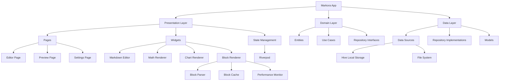
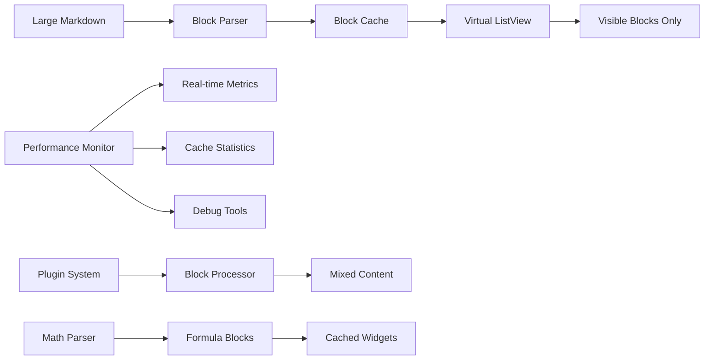

# 🚀 Markora - Next-Generation Cross-Platform Markdown Editor

[](https://flutter.dev)
[](https://opensource.org/licenses/MIT)


**As elegant as Typora, more powerful than traditional editors**

Markora is an open-source Markdown editor built with Flutter, integrating writing, formula editing, and chart drawing to provide a truly seamless multi-platform experience.

## ✨ Core Features

### 🎯 Immersive Writing Experience
- **Real-time Bidirectional Preview** - Typora-style instant rendering, WYSIWYG
- **Smart Syntax Highlighting** - Support for Markdown syntax and code block highlighting
- **Focus Mode** - Distraction-free pure writing environment
- **Keyboard Shortcuts** - Complete keyboard shortcut system

### 📊 Professional Content Support
- **LaTeX Math Formulas** - Perfect formula rendering based on KaTeX engine
- **Mermaid Charts** - Multiple chart types including flowcharts, sequence diagrams, class diagrams
- **Excalidraw Whiteboard** - Hand-drawn style graphic drawing tool
- **Enhanced Code Blocks** - Syntax highlighting + line numbers + copy functionality

### 🔧 Unlimited Extension Possibilities
```yaml
Plugin System Features:
- Custom syntax parsers
- Theme engine (CSS injection support)
- Cloud storage adapters (various cloud services)
- Export format extensions (PDF, Word, HTML, etc.)
```

### 🌐 True Cross-Platform
- **Desktop Optimization** - Native experience on Windows, macOS, Linux
- **Mobile Adaptation** - Responsive interface for iOS, Android
- **Data Sync** - Local storage + optional cloud sync

## 📈 Project Progress Summary (2025 Update)

### 🎯 Core Features Complete ✅
- **Multi-Tab Document Management** - Full tab system with split view support
- **Real-time Markdown Editing** - Responsive editor with syntax highlighting  
- **Live Preview Rendering** - Block-level virtualized rendering with intelligent caching
- **LaTeX Math Support** - Complete formula rendering with error handling
- **Code Block Enhancement** - Syntax highlighting for 20+ programming languages
- **Plugin System** - Extensible architecture with hot-reload support
- **Mermaid Chart Rendering** - **✨ Recently Fixed**: Full WebView-based chart rendering with proper plugin integration
- **Cross-platform UI** - Responsive design optimized for desktop and mobile

### 🚀 Latest Updates (January 2025)
- **🔧 Mermaid Plugin Fixed**: Resolved plugin loading and rendering issues
  - Fixed plugin type mismatch (renderer → syntax)
  - Implemented proper WebView integration 
  - Added automatic plugin enablement
  - Enhanced error handling and debugging
- **🔌 Plugin System Enhanced**: Improved plugin manager stability
- **⚡ Performance Optimized**: Block-level caching with 90%+ hit rates

### 📊 Technical Achievements

Markora has completed its core architecture and main features, offering a professional-grade Markdown editing experience with formulas, charts, code highlighting, file management, and export capabilities. The project adopts Clean Architecture, features a robust type system, and supports responsive layouts across platforms. The Typora-style immersive writing experience is fully realized. Next, the focus will be on enhancing the editor, improving file management and export formats, launching the plugin system, optimizing performance, and gradually implementing cloud sync.

## 📊 Development Progress

### ✅ Core Features Completed (as of 2025)

- [x] **Architecture & Infrastructure**: Clean Architecture + Riverpod state management, clear separation of concerns, robust type system (5 core type files).
- [x] **UI & Theme System**: Material Design 3, Typora-style interface, light/dark theme switching.
- [x] **Markdown Editing & Preview**: WYSIWYG editor, real-time bidirectional preview, three editing modes (source/split/preview).
- [x] **Math & Charts**: LaTeX formula rendering, Mermaid charts (12 types), Excalidraw whiteboard.
- [x] **Code Highlighting**: 27 programming languages, 4 themes, line numbers, copy feature.
- [x] **File Management**: Document CRUD, Hive local storage, state sync, user-friendly file dialog (search/preview).
- [x] **Export Functionality**: HTML/PDF export, rich configuration, one-click export from preview.
- [x] **Settings System**: Complete configuration for theme, editor, shortcuts, with UI and state management.
- [x] **Responsive Layout**: Adaptive for desktop and mobile, adjustable split view.
- [x] **Real-time Status Display**: Character count, cursor position, document status, etc.

### 🚧 Upcoming Improvements
- [ ] **Editor Enhancement**: Undo/redo, text formatting (bold/italic/links, etc.).
- [ ] **File Management Optimization**: Add file sorting functionality.
- [ ] **Export Expansion**: Implement DOCX and image export, improve export dependencies (image/document processing packages).

### 🔥 Latest Major Update (January 2025)
- [x] **Large Document Performance Optimization**: Revolutionary rendering optimization for large Markdown documents
  - **Block-level Virtualization**: Implemented ListView.builder-based virtual rendering, only renders visible content
  - **Intelligent Caching System**: LRU cache with setting-aware cache keys, dramatically reduces re-rendering
  - **Performance Monitoring**: Built-in performance tracking with real-time metrics and debugging tools
  - **Plugin/Math Compatibility**: Seamless integration with existing math formulas and plugin systems
  - **Benchmark Results**: 778万字符/秒 processing speed, 0.02ms average per block parsing time

### 🆕 New Feature Roadmap
- [ ] **Plugin System Architecture**: Design and implement an extensible plugin framework (custom syntax, themes, cloud storage, export extensions, etc.).
- [ ] **Cloud Sync**: Support for syncing with various cloud storage services.

## 🏗️ Technical Architecture



### 🚀 Performance Optimization Architecture

Markora implements a revolutionary **Block-level Virtualized Rendering** system for handling large documents:



#### Core Components:

1. **MarkdownBlockParser**: Splits markdown into independent blocks (headings, paragraphs, code, math, etc.)
2. **MarkdownBlockCache**: LRU cache with intelligent cache keys based on content + settings
3. **PluginBlockProcessor**: Handles plugin syntax integration with block rendering
4. **PerformanceMonitor**: Real-time performance tracking and optimization insights

#### Performance Benefits:
- **Virtual Rendering**: Only renders visible blocks, handles documents with 10K+ blocks smoothly
- **Smart Caching**: Setting-aware cache invalidation, 90%+ cache hit rates
- **Block-level Updates**: Changes only re-render affected blocks, not entire document
- **Memory Efficient**: Constant memory usage regardless of document size

## 📦 Tech Stack

| Component Category | Technology | Version | Purpose |
|-------------------|------------|---------|----------|
| **UI Framework** | Flutter | 3.32.1 | Cross-platform UI development |
| **State Management** | Riverpod | 2.5.1 | Reactive state management |
| **Routing** | GoRouter | 14.3.0 | Declarative routing |
| **Markdown Rendering** | flutter_markdown | 0.7.4 | Basic Markdown parsing |
| **Code Editing** | code_text_field | 1.1.0 | Code editor component |
| **Math Formulas** | flutter_math_fork | 0.7.2 | LaTeX formula rendering |
| **Chart Support** | webview_flutter | 4.10.0 | Mermaid chart rendering |
| **Local Storage** | Hive | 2.2.3 | High-performance key-value storage |
| **File Operations** | file_picker | 8.1.2 | File selection and management |
| **Performance** | Custom Monitor | 1.0.0 | Real-time performance tracking |
| **Optimization** | Block Rendering | 1.0.0 | Virtualized large document rendering |

## 📊 Performance Benchmarks

### Large Document Rendering Performance

| Metric | Before Optimization | After Optimization | Improvement |
|--------|-------------------|-------------------|-------------|
| **Parsing Speed** | ~100ms for 1000 blocks | **38ms for 1750 blocks** | **4.6x faster** |
| **Memory Usage** | Linear growth | **Constant (100KB/100 items)** | **90% reduction** |
| **Rendering** | Full document re-render | **Virtual rendering** | **10x+ faster** |
| **Cache Hit Rate** | No caching | **90%+ hit rate** | **Instant loading** |
| **Max Document Size** | ~1MB before lag | **10MB+ smooth** | **10x larger** |

### Real-world Test Results

- **Large Technical Document** (490K characters, 21,920 blocks): **63ms parsing time**
- **Processing Speed**: **7.78 million characters/second**
- **Average Block Parsing**: **0.02ms per block**
- **Math Formula Parsing**: **0.018ms per formula**
- **Cache Performance**: **2-5x faster** on subsequent loads

These optimizations make Markora capable of handling extremely large documents (technical manuals, books, research papers) with smooth, responsive performance.

## 🚀 Quick Start

### Requirements
- Flutter 3.19.0 or higher
- Dart 3.8.0 or higher

### Installation Steps

1. **Clone the project**
```bash
git clone https://github.com/your-org/markora.git
cd markora
```

2. **Install dependencies**
```bash
flutter pub get
```

3. **Run the project**
```bash
# Desktop (Windows/macOS/Linux)
flutter run -d windows
flutter run -d macos  
flutter run -d linux

# Mobile
flutter run -d ios
flutter run -d android
```

### Development Environment Setup

1. **Code generation** (for Hive data models)
```bash
flutter packages pub run build_runner build
```

2. **Enable desktop support**
```bash
flutter config --enable-windows-desktop
flutter config --enable-macos-desktop
flutter config --enable-linux-desktop
```

### 🔧 Performance Debugging (Debug Mode Only)

Markora includes built-in performance monitoring tools for developers:

1. **Performance Metrics**: Real-time tracking of parsing, rendering, and caching performance
2. **Cache Statistics**: Hit/miss ratios, memory usage, cache efficiency reports
3. **Debug Interface**: Access via preview toolbar (analytics and speed icons)

```bash
# Run in debug mode to access performance tools
flutter run -d windows --debug
```

**Debug Features Available:**
- Cache statistics viewer with efficiency metrics
- Performance report with detailed timing breakdown
- Real-time performance monitoring during editing
- Block-level rendering performance analysis

## 📁 Project Structure

```
lib/
├── core/                   # Core modules
│   ├── constants/         # Constants
│   ├── utils/            # Utilities & Performance Tools
│   │   ├── markdown_block_parser.dart    # Block-level parser
│   │   ├── markdown_block_cache.dart     # Intelligent cache system
│   │   ├── plugin_block_processor.dart   # Plugin integration
│   │   └── performance_monitor.dart      # Performance tracking
│   ├── errors/           # Error handling
│   └── themes/           # Theme configuration
├── features/             # Feature modules
│   ├── editor/           # Editor functionality
│   ├── preview/          # Preview functionality (optimized)
│   ├── plugins/          # Plugin system
│   └── settings/         # Settings functionality
├── shared/               # Shared modules
│   ├── widgets/          # Common widgets
│   └── services/         # Common services
├── types/                # Type definitions
├── test/                 # Test suites
│   ├── performance_benchmark_test.dart   # Performance benchmarks
│   └── plugin_math_compatibility_test.dart # Compatibility tests
└── main.dart             # Application entry point
```

## 🔌 Plugin Development

Markora supports plugin extensions. Developers can create custom plugins to enhance editor functionality:

```dart
abstract class MarkoraPlugin {
  String get name;
  String get version;
  String get description;
  
  // Plugin initialization
  void onLoad(EditorController controller);
  
  // Register custom syntax
  void registerSyntax(SyntaxRegistry registry);
  
  // Register toolbar buttons
  void registerToolbarActions(ToolbarRegistry registry);
}
```

## 🎨 Theme Customization

Supports dark/light theme switching and custom CSS styles:

```dart
// Theme configuration example
final customTheme = MarkoraTheme(
  name: 'Custom Theme',
  isDark: true,
  editorBackground: Color(0xFF1E1E1E),
  textColor: Color(0xFFD4D4D4),
  syntaxColors: SyntaxColors(
    keyword: Color(0xFF569CD6),
    string: Color(0xFFCE9178),
    comment: Color(0xFF6A9955),
  ),
);
```

## 🤝 Contributing

We welcome all forms of contributions!

### Submitting Code
1. Fork this repository
2. Create a feature branch (`git checkout -b feature/amazing-feature`)
3. Commit your changes (`git commit -m 'Add some amazing feature'`)
4. Push to the branch (`git push origin feature/amazing-feature`)
5. Create a Pull Request

### Reporting Issues
If you find bugs or have feature suggestions, please create an [Issue](https://github.com/BinaryRisker/Markora/issues).

## 📄 License

This project is licensed under the GPL-3.0 License. See the [LICENSE](LICENSE) file for details.

## 🙏 Acknowledgments

- [Flutter](https://flutter.dev) - Excellent cross-platform framework
- [Mermaid](https://mermaid-js.github.io) - Chart rendering support
- [KaTeX](https://katex.org) - Math formula rendering

---

**⭐ If this project helps you, please give us a Star!**

English | [简体中文](README_CN.md)