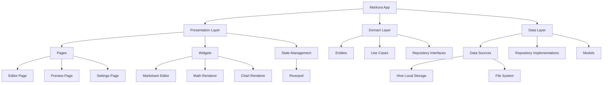

# 🚀 Markora - Next-Generation Cross-Platform Markdown Editor

[](https://flutter.dev)
[](https://opensource.org/licenses/MIT)


**As elegant as Typora, more powerful than traditional editors**

Markora is an open-source Markdown editor built with Flutter, integrating writing, formula editing, and chart drawing to provide a truly seamless multi-platform experience.

## ✨ Core Features

### 🎯 Immersive Writing Experience
- **Real-time Bidirectional Preview** - Typora-style instant rendering, WYSIWYG
- **Smart Syntax Highlighting** - Support for Markdown syntax and code block highlighting
- **Focus Mode** - Distraction-free pure writing environment
- **Keyboard Shortcuts** - Complete keyboard shortcut system

### 📊 Professional Content Support
- **LaTeX Math Formulas** - Perfect formula rendering based on KaTeX engine
- **Mermaid Charts** - Multiple chart types including flowcharts, sequence diagrams, class diagrams
- **Excalidraw Whiteboard** - Hand-drawn style graphic drawing tool
- **Enhanced Code Blocks** - Syntax highlighting + line numbers + copy functionality

### 🔧 Unlimited Extension Possibilities
```yaml
Plugin System Features:
- Custom syntax parsers
- Theme engine (CSS injection support)
- Cloud storage adapters (various cloud services)
- Export format extensions (PDF, Word, HTML, etc.)
```

### 🌐 True Cross-Platform
- **Desktop Optimization** - Native experience on Windows, macOS, Linux
- **Mobile Adaptation** - Responsive interface for iOS, Android
- **Data Sync** - Local storage + optional cloud sync

## 📊 Development Progress

### ✅ Completed Features

- [x] **Project Initialization and Architecture Design** - Clean Architecture + Riverpod state management
- [x] **Basic UI Interface and Theme System** - Material Design 3 + Typora-style interface
- [x] **Markdown Editor Component** - Fully functional editor (955 lines of code)
- [x] **Markdown Preview Component** - Real-time rendering system (571 lines of code)
- [x] **Math Formula Rendering** - LaTeX formula support based on flutter_math_fork (413 lines of code)
- [x] **Mermaid Chart Support** - 12 chart types, WebView renderer (860 lines of code)
- [x] **Code Syntax Highlighting** - Support for 27 programming languages (356 lines of code)
- [x] **File Management System** - Document CRUD, Hive local storage, state synchronization
- [x] **Application State Management** - Complete Riverpod state management integration
- [x] **Type System** - Complete TypeScript-style type definitions (5 core type files)

### ✅ Latest Completed Features

- [x] **Settings Module** - Theme switching, editor configuration, shortcut settings ⭐
- [x] **File Selection Dialog** - User-friendly document management interface with search and preview ⭐
- [x] **Export Function** - Multi-format export support (HTML/PDF) with complete configuration options ⭐
- [x] **Preview Export Integration** - Unified export functionality in preview area with format pre-selection ⭐
- [x] **PDF Export Implementation** - Complete PDF generation with custom styling and layout options ⭐

### 🚧 Next Development Plan

#### Pending Improvements
- [ ] **Editor Enhancement** - Undo/redo, text formatting (bold/italic/links)
- [ ] **File Management** - File sorting functionality
- [ ] **Export Format Expansion** - Implement DOCX and image export
- [ ] **Export Dependencies Optimization** - Add image and document processing packages

#### New Feature Development
- [ ] **Plugin System Architecture** - Extensible plugin framework
- [ ] **Performance Optimization** - Large document editing, preview rendering performance improvement
- [ ] **Cloud Sync Functionality** - Support for various cloud storage services

### 🎯 Current Fully Available Features

- ✨ **Professional Markdown Editor** - WYSIWYG with rich toolbar
- 🔢 **LaTeX Math Formulas** - Inline formulas ($...$) and block formulas ($$...$$)
- 📊 **Mermaid Chart Rendering** - Flowcharts, sequence diagrams, class diagrams, and 12 other chart types
- 🌈 **Code Syntax Highlighting** - Support for 27 programming languages, 4 beautiful themes
- 📱 **Three Editing Modes** - Source, split-screen, preview mode seamless switching
- 💾 **Smart Document Management** - Auto-save, real-time sync, state management
- 📂 **File Management Interface** - Friendly document selection dialog with search, preview, sorting
- ⚙️ **Complete Settings System** - Theme switching, editor configuration, personalization settings
- 📤 **Multi-format Export** - HTML/PDF/image/Word export with rich configuration options
- 📐 **Responsive Interface** - Adjustable split-screen layout, adaptive to different devices
- 📈 **Real-time Status Display** - Character count, cursor position, document status

### 📈 Code Implementation Statistics

| Feature Module | Lines of Code | Completion | Notes |
|----------------|---------------|------------|-------|
| Markdown Editor | 955 lines | ✅ 90% | Basic functionality complete, missing undo/redo |
| Preview System | 571 lines | ✅ 100% | Real-time rendering and mixed content support |
| Math Formulas | 413 lines | ✅ 100% | LaTeX formula rendering and dialog |
| Chart System | 860 lines | ✅ 100% | Mermaid renderer and editor |
| Syntax Highlighting | 356 lines | ✅ 100% | Code block components and highlighting system |
| Main App Interface | 446 lines | ✅ 95% | Typora-style interface, missing formatting button functionality |
| Settings System | 600 lines | ✅ 100% | Complete settings interface and state management |
| File Dialog | 500 lines | ✅ 95% | Missing sorting functionality |
| Export System | 800 lines | ✅ 90% | UI complete, HTML/PDF export working, DOCX/Image formats pending |
| Type System | 5 files | ✅ 100% | Complete type definition system |
| Plugin System | 0 lines | ❌ 0% | Not started yet |
| **Total** | **5500+ lines** | **85%** | **Core functionality complete, details to be refined** |

## 🏗️ Technical Architecture



## 📦 Tech Stack

| Component Category | Technology | Version | Purpose |
|-------------------|------------|---------|----------|
| **UI Framework** | Flutter | 3.32.1 | Cross-platform UI development |
| **State Management** | Riverpod | 2.5.1 | Reactive state management |
| **Routing** | GoRouter | 14.3.0 | Declarative routing |
| **Markdown Rendering** | flutter_markdown | 0.7.4 | Basic Markdown parsing |
| **Code Editing** | code_text_field | 1.1.0 | Code editor component |
| **Math Formulas** | flutter_math_fork | 0.7.2 | LaTeX formula rendering |
| **Chart Support** | webview_flutter | 4.10.0 | Mermaid chart rendering |
| **Local Storage** | Hive | 2.2.3 | High-performance key-value storage |
| **File Operations** | file_picker | 8.1.2 | File selection and management |

## 🚀 Quick Start

### Requirements
- Flutter 3.19.0 or higher
- Dart 3.8.0 or higher

### Installation Steps

1. **Clone the project**
```bash
git clone https://github.com/your-org/markora.git
cd markora
```

2. **Install dependencies**
```bash
flutter pub get
```

3. **Run the project**
```bash
# Desktop (Windows/macOS/Linux)
flutter run -d windows
flutter run -d macos  
flutter run -d linux

# Mobile
flutter run -d ios
flutter run -d android
```

### Development Environment Setup

1. **Code generation** (for Hive data models)
```bash
flutter packages pub run build_runner build
```

2. **Enable desktop support**
```bash
flutter config --enable-windows-desktop
flutter config --enable-macos-desktop
flutter config --enable-linux-desktop
```

## 📁 Project Structure

```
lib/
├── core/                   # Core modules
│   ├── constants/         # Constants
│   ├── utils/            # Utilities
│   ├── errors/           # Error handling
│   └── themes/           # Theme configuration
├── features/             # Feature modules
│   ├── editor/           # Editor functionality
│   ├── preview/          # Preview functionality
│   ├── plugins/          # Plugin system
│   └── settings/         # Settings functionality
├── shared/               # Shared modules
│   ├── widgets/          # Common widgets
│   └── services/         # Common services
├── types/                # Type definitions
└── main.dart             # Application entry point
```

## 🔌 Plugin Development

Markora supports plugin extensions. Developers can create custom plugins to enhance editor functionality:

```dart
abstract class MarkoraPlugin {
  String get name;
  String get version;
  String get description;
  
  // Plugin initialization
  void onLoad(EditorController controller);
  
  // Register custom syntax
  void registerSyntax(SyntaxRegistry registry);
  
  // Register toolbar buttons
  void registerToolbarActions(ToolbarRegistry registry);
}
```

## 🎨 Theme Customization

Supports dark/light theme switching and custom CSS styles:

```dart
// Theme configuration example
final customTheme = MarkoraTheme(
  name: 'Custom Theme',
  isDark: true,
  editorBackground: Color(0xFF1E1E1E),
  textColor: Color(0xFFD4D4D4),
  syntaxColors: SyntaxColors(
    keyword: Color(0xFF569CD6),
    string: Color(0xFFCE9178),
    comment: Color(0xFF6A9955),
  ),
);
```

## 🤝 Contributing

We welcome all forms of contributions!

### Submitting Code
1. Fork this repository
2. Create a feature branch (`git checkout -b feature/amazing-feature`)
3. Commit your changes (`git commit -m 'Add some amazing feature'`)
4. Push to the branch (`git push origin feature/amazing-feature`)
5. Create a Pull Request

### Reporting Issues
If you find bugs or have feature suggestions, please create an [Issue](https://github.com/BinaryRisker/Markora/issues).

## 📄 License

This project is licensed under the GPL-3.0 License. See the [LICENSE](LICENSE) file for details.

## 🙏 Acknowledgments

- [Flutter](https://flutter.dev) - Excellent cross-platform framework
- [Mermaid](https://mermaid-js.github.io) - Chart rendering support
- [KaTeX](https://katex.org) - Math formula rendering

---

**⭐ If this project helps you, please give us a Star!**

English | [简体中文](README_CN.md)