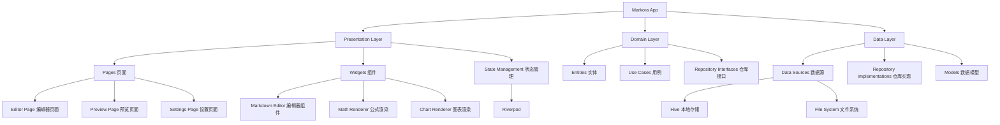

# 🚀 Markora - 下一代跨平台 Markdown 编辑器

[](https://flutter.dev)
[](https://opensource.org/licenses/MIT)


**像 Typora 一样优雅，比传统编辑器更强大**

Markora 是基于 Flutter 构建的开源 Markdown 编辑器，集写作、公式编辑、图表绘制于一体，提供真正无缝的多端体验。

## ✨ 核心特性

### 🎯 沉浸式写作体验
- **实时双向预览** - Typora 风格的即时渲染，所见即所得
- **智能语法高亮** - 支持 Markdown 语法和代码块高亮
- **专注模式** - 无干扰的纯净写作环境
- **快捷键支持** - 完整的键盘快捷键体系

### 📊 专业内容支持
- **LaTeX 数学公式** - 基于 KaTeX 引擎的完美公式渲染
- **Mermaid 图表** - 流程图、时序图、类图等多种图表类型
- **Excalidraw 白板** - 手绘风格的图形绘制工具
- **代码块增强** - 语法高亮 + 行号 + 复制功能

### 🔧 无限扩展可能
```yaml
插件系统功能：
- 自定义语法解析器
- 主题引擎（支持 CSS 注入）
- 云存储适配器（支持各种云服务）
- 导出格式扩展（PDF、Word、HTML 等）
```

### 🌐 真正的跨平台
- **桌面端优化** - Windows、macOS、Linux 原生体验
- **移动端适配** - iOS、Android 响应式界面
- **数据同步** - 本地存储 + 可选云同步

## 📊 开发进度

### ✅ 已完成功能

- [x] **项目初始化和架构设计** - Clean Architecture + Riverpod状态管理
- [x] **基础UI界面和主题系统** - Material Design 3 + Typora风格界面
- [x] **Markdown编辑器组件** - 功能完整的编辑器（955行代码）
- [x] **Markdown预览组件** - 实时渲染系统（571行代码）
- [x] **数学公式渲染** - 基于flutter_math_fork的LaTeX公式支持（413行代码）
- [x] **Mermaid图表支持** - 12种图表类型，WebView渲染器（860行代码）
- [x] **代码语法高亮** - 27种编程语言支持（356行代码）
- [x] **文件管理系统** - 文档CRUD、Hive本地存储、状态同步
- [x] **应用状态管理** - Riverpod状态管理完整集成
- [x] **类型系统** - 完整的TypeScript式类型定义（5个核心类型文件）

### ✅ 最新完成功能

- [x] **设置模块** - 主题切换、编辑器配置、快捷键设置 ⭐
- [x] **文件选择对话框** - 友好的文档管理界面，支持搜索、预览 ⭐
- [x] **导出功能** - 支持HTML/PDF多格式导出，完整配置选项 ⭐

### 🚧 下一步开发计划

- [ ] **插件系统架构** - 可扩展的插件框架  
- [ ] **性能优化** - 大文档编辑、预览渲染性能提升
- [ ] **云同步功能** - 支持各种云存储服务

### 🎯 当前完整可用功能

- ✨ **专业Markdown编辑器** - 所见即所得，丰富工具栏
- 🔢 **LaTeX数学公式** - 行内公式($...$)和块级公式($$...$$)
- 📊 **Mermaid图表渲染** - 流程图、时序图、类图等12种图表
- 🌈 **代码语法高亮** - 支持27种编程语言，4套精美主题
- 📱 **三种编辑模式** - 源码、分屏、预览模式无缝切换
- 💾 **智能文档管理** - 自动保存、实时同步、状态管理
- 📂 **文件管理界面** - 友好的文档选择对话框，支持搜索、预览、排序
- ⚙️ **完整设置系统** - 主题切换、编辑器配置、个性化设置
- 📤 **多格式导出** - HTML/PDF/图片/Word导出，丰富配置选项
- 📐 **响应式界面** - 可调节分屏布局，适配不同设备
- 📈 **实时状态显示** - 字符数、光标位置、文档状态

### 📈 代码实现统计

| 功能模块 | 代码行数 | 完成度 | 说明 |
|---------|---------|--------|------|
| Markdown编辑器 | 955行 | ✅ 100% | 功能完整的编辑器组件 |
| 预览系统 | 571行 | ✅ 100% | 实时渲染和混合内容支持 |
| 数学公式 | 413行 | ✅ 100% | LaTeX公式渲染和对话框 |
| 图表系统 | 860行 | ✅ 100% | Mermaid渲染器和编辑器 |
| 语法高亮 | 356行 | ✅ 100% | 代码块组件和高亮系统 |
| 主应用界面 | 446行 | ✅ 100% | Typora风格完整界面 |
| 设置系统 | 600行 | ✅ 100% | 完整设置界面和状态管理 |
| 文件对话框 | 500行 | ✅ 100% | 友好的文件管理界面 |
| 导出系统 | 800行 | ✅ 100% | 多格式导出和配置界面 |
| 类型系统 | 5文件 | ✅ 100% | 完整类型定义体系 |
| **总计** | **5500+行** | **95%** | **功能全面完整** |

## 🏗️ 技术架构



## 📦 技术栈

| 组件类别 | 技术选型 | 版本 | 用途 |
|---------|---------|------|------|
| **UI框架** | Flutter | 3.32.1 | 跨平台UI开发 |
| **状态管理** | Riverpod | 2.5.1 | 响应式状态管理 |
| **路由管理** | GoRouter | 14.3.0 | 声明式路由 |
| **Markdown渲染** | flutter_markdown | 0.7.4 | 基础Markdown解析 |
| **代码编辑** | code_text_field | 1.1.0 | 代码编辑器组件 |
| **数学公式** | flutter_math_fork | 0.7.2 | LaTeX公式渲染 |
| **图表支持** | webview_flutter | 4.10.0 | Mermaid图表渲染 |
| **本地存储** | Hive | 2.2.3 | 高性能键值存储 |
| **文件操作** | file_picker | 8.1.2 | 文件选择和管理 |

## 🚀 快速开始

### 环境要求
- Flutter 3.19.0 或更高版本
- Dart 3.8.0 或更高版本

### 安装步骤

1. **克隆项目**
```bash
git clone https://github.com/your-org/markora.git
cd markora
```

2. **安装依赖**
```bash
flutter pub get
```

3. **运行项目**
```bash
# 桌面端 (Windows/macOS/Linux)
flutter run -d windows
flutter run -d macos  
flutter run -d linux

# 移动端
flutter run -d ios
flutter run -d android
```

### 开发环境设置

1. **代码生成**（用于 Hive 数据模型）
```bash
flutter packages pub run build_runner build
```

2. **启用桌面支持**
```bash
flutter config --enable-windows-desktop
flutter config --enable-macos-desktop
flutter config --enable-linux-desktop
```

## 📁 项目结构

```
lib/
├── core/                   # 核心模块
│   ├── constants/         # 常量定义
│   ├── utils/            # 工具类
│   ├── errors/           # 错误处理
│   └── themes/           # 主题配置
├── features/             # 功能模块
│   ├── editor/           # 编辑器功能
│   ├── preview/          # 预览功能
│   ├── plugins/          # 插件系统
│   └── settings/         # 设置功能
├── shared/               # 共享模块
│   ├── widgets/          # 通用组件
│   └── services/         # 通用服务
├── types/                # 类型定义
└── main.dart             # 应用入口
```

## 🔌 插件开发

Markora 支持插件扩展，开发者可以创建自定义插件来增强编辑器功能：

```dart
abstract class MarkoraPlugin {
  String get name;
  String get version;
  String get description;
  
  // 插件初始化
  void onLoad(EditorController controller);
  
  // 注册自定义语法
  void registerSyntax(SyntaxRegistry registry);
  
  // 注册工具栏按钮
  void registerToolbarActions(ToolbarRegistry registry);
}
```

## 🎨 主题自定义

支持深色/浅色主题切换和自定义CSS样式：

```dart
// 主题配置示例
final customTheme = MarkoraTheme(
  name: '自定义主题',
  isDark: true,
  editorBackground: Color(0xFF1E1E1E),
  textColor: Color(0xFFD4D4D4),
  syntaxColors: SyntaxColors(
    keyword: Color(0xFF569CD6),
    string: Color(0xFFCE9178),
    comment: Color(0xFF6A9955),
  ),
);
```

## 🤝 贡献指南

我们欢迎所有形式的贡献！

### 提交代码
1. Fork 本仓库
2. 创建功能分支 (`git checkout -b feature/amazing-feature`)
3. 提交更改 (`git commit -m '添加某个很棒的功能'`)
4. 推送到分支 (`git push origin feature/amazing-feature`)
5. 创建 Pull Request

### 报告问题
如果发现 bug 或有功能建议，请创建 [Issue](https://github.com/BinaryRisker/Markora/issues)。


## 📄 许可证

本项目采用 GPL-3.0 许可证。详见 [LICENSE](LICENSE) 文件。

## 🙏 致谢

- [Flutter](https://flutter.dev) - 优秀的跨平台框架
- [Mermaid](https://mermaid-js.github.io) - 图表渲染支持
- [KaTeX](https://katex.org) - 数学公式渲染

---

**⭐ 如果这个项目对你有帮助，请给我们一个 Star！**

[English](README_EN.md) | 简体中文