# 🚀 Markora - 下一代跨平台 Markdown 编辑器

[](https://flutter.dev)
[](https://opensource.org/licenses/MIT)


**像 Typora 一样优雅，比传统编辑器更强大**

Markora 是基于 Flutter 构建的开源 Markdown 编辑器，集写作、公式编辑、图表绘制于一体，提供真正无缝的多端体验。

## ✨ 核心特性

### 🎯 沉浸式写作体验
- **实时双向预览** - Typora 风格的即时渲染，所见即所得
- **智能语法高亮** - 支持 Markdown 语法和代码块高亮
- **专注模式** - 无干扰的纯净写作环境
- **快捷键支持** - 完整的键盘快捷键体系

### 📊 专业内容支持
- **LaTeX 数学公式** - 基于 KaTeX 引擎的完美公式渲染
- **Mermaid 图表** - 流程图、时序图、类图等多种图表类型
- **Excalidraw 白板** - 手绘风格的图形绘制工具
- **代码块增强** - 语法高亮 + 行号 + 复制功能

### 🔧 无限扩展可能
```yaml
插件系统功能：
- 自定义语法解析器
- 主题引擎（支持 CSS 注入）
- 云存储适配器（支持各种云服务）
- 导出格式扩展（PDF、Word、HTML 等）
```

### 🌐 真正的跨平台
- **桌面端优化** - Windows、macOS、Linux 原生体验
- **移动端适配** - iOS、Android 响应式界面
- **数据同步** - 本地存储 + 可选云同步

## 📊 开发进度

### ✅ 已完成功能

- [x] **项目初始化和架构设计** - Clean Architecture + Riverpod
- [x] **基础UI界面和主题系统** - Material Design 3 + Typora风格界面
- [x] **Markdown编辑器组件** - 支持工具栏、格式化、实时编辑
- [x] **Markdown预览组件** - 实时渲染、数学公式框架、代码块支持
- [x] **应用状态管理** - Riverpod状态管理完整集成
- [x] **文件管理系统** - 文档CRUD、本地存储、状态同步

### 🚧 开发中功能

- [ ] **数学公式渲染** - LaTeX公式实时渲染
- [ ] **代码语法高亮** - 编辑器语法高亮优化
- [ ] **Mermaid图表支持** - 流程图、时序图、架构图
- [ ] **主题切换系统** - 深色/浅色主题动态切换
- [ ] **文件选择对话框** - 打开已保存的文档列表
- [ ] **导出功能** - PDF/HTML导出
- [ ] **插件系统** - 可扩展的插件架构

### 🎯 当前可用功能

- ✨ **实时Markdown编辑和预览** - 所见即所得体验
- 🛠️ **丰富的格式化工具栏** - 粗体、斜体、标题、链接、图片、代码块等
- 📊 **三种编辑模式** - 源码、分屏、预览模式切换
- 💾 **文档管理** - 新建、保存、内容同步
- 📱 **响应式界面** - 自适应布局和分屏调节
- 📈 **状态栏信息** - 字符数、光标位置实时显示

## 🏗️ 技术架构

```mermaid
graph TB
    A[Markora App] --> B[Presentation Layer]
    A --> C[Domain Layer]
    A --> D[Data Layer]
    
    B --> E[Pages 页面]
    B --> F[Widgets 组件]
    B --> G[State Management 状态管理]
    
    C --> H[Entities 实体]
    C --> I[Use Cases 用例]
    C --> J[Repository Interfaces 仓库接口]
    
    D --> K[Data Sources 数据源]
    D --> L[Repository Implementations 仓库实现]
    D --> M[Models 数据模型]
    
    G --> N[Riverpod]
    K --> O[Hive 本地存储]
    K --> P[File System 文件系统]
    
    E --> Q[Editor Page 编辑器页面]
    E --> R[Preview Page 预览页面]
    E --> S[Settings Page 设置页面]
    
    F --> T[Markdown Editor 编辑器组件]
    F --> U[Math Renderer 公式渲染]
    F --> V[Chart Renderer 图表渲染]
```



## 📦 技术栈

| 组件类别 | 技术选型 | 版本 | 用途 |
|---------|---------|------|------|
| **UI框架** | Flutter | 3.32.1 | 跨平台UI开发 |
| **状态管理** | Riverpod | 2.5.1 | 响应式状态管理 |
| **路由管理** | GoRouter | 14.3.0 | 声明式路由 |
| **Markdown渲染** | flutter_markdown | 0.7.4 | 基础Markdown解析 |
| **代码编辑** | code_text_field | 1.1.0 | 代码编辑器组件 |
| **数学公式** | flutter_math_fork | 0.7.2 | LaTeX公式渲染 |
| **图表支持** | webview_flutter | 4.10.0 | Mermaid图表渲染 |
| **本地存储** | Hive | 2.2.3 | 高性能键值存储 |
| **文件操作** | file_picker | 8.1.2 | 文件选择和管理 |

## 🚀 快速开始

### 环境要求
- Flutter 3.19.0 或更高版本
- Dart 3.8.0 或更高版本

### 安装步骤

1. **克隆项目**
```bash
git clone https://github.com/your-org/markora.git
cd markora
```

2. **安装依赖**
```bash
flutter pub get
```

3. **运行项目**
```bash
# 桌面端 (Windows/macOS/Linux)
flutter run -d windows
flutter run -d macos  
flutter run -d linux

# 移动端
flutter run -d ios
flutter run -d android
```

### 开发环境设置

1. **代码生成**（用于 Hive 数据模型）
```bash
flutter packages pub run build_runner build
```

2. **启用桌面支持**
```bash
flutter config --enable-windows-desktop
flutter config --enable-macos-desktop
flutter config --enable-linux-desktop
```

## 📁 项目结构

```
lib/
├── core/                   # 核心模块
│   ├── constants/         # 常量定义
│   ├── utils/            # 工具类
│   ├── errors/           # 错误处理
│   └── themes/           # 主题配置
├── features/             # 功能模块
│   ├── editor/           # 编辑器功能
│   ├── preview/          # 预览功能
│   ├── plugins/          # 插件系统
│   └── settings/         # 设置功能
├── shared/               # 共享模块
│   ├── widgets/          # 通用组件
│   └── services/         # 通用服务
├── types/                # 类型定义
└── main.dart             # 应用入口
```

## 🔌 插件开发

Markora 支持插件扩展，开发者可以创建自定义插件来增强编辑器功能：

```dart
abstract class MarkoraPlugin {
  String get name;
  String get version;
  String get description;
  
  // 插件初始化
  void onLoad(EditorController controller);
  
  // 注册自定义语法
  void registerSyntax(SyntaxRegistry registry);
  
  // 注册工具栏按钮
  void registerToolbarActions(ToolbarRegistry registry);
}
```

## 🎨 主题自定义

支持深色/浅色主题切换和自定义CSS样式：

```dart
// 主题配置示例
final customTheme = MarkoraTheme(
  name: '自定义主题',
  isDark: true,
  editorBackground: Color(0xFF1E1E1E),
  textColor: Color(0xFFD4D4D4),
  syntaxColors: SyntaxColors(
    keyword: Color(0xFF569CD6),
    string: Color(0xFFCE9178),
    comment: Color(0xFF6A9955),
  ),
);
```

## 🤝 贡献指南

我们欢迎所有形式的贡献！

### 提交代码
1. Fork 本仓库
2. 创建功能分支 (`git checkout -b feature/amazing-feature`)
3. 提交更改 (`git commit -m '添加某个很棒的功能'`)
4. 推送到分支 (`git push origin feature/amazing-feature`)
5. 创建 Pull Request

### 报告问题
如果发现 bug 或有功能建议，请创建 [Issue](https://github.com/your-org/markora/issues)。

### 开发规范
- 所有代码必须使用中文注释
- 遵循 Clean Architecture 架构
- 单个文件不超过 200 行
- 使用 Riverpod 进行状态管理
- 禁止使用 `any` 和 `unknown` 类型

## 📄 许可证

本项目采用 MIT 许可证。详见 [LICENSE](LICENSE) 文件。

## 🙏 致谢

- [Flutter](https://flutter.dev) - 优秀的跨平台框架
- [Typora](https://typora.io) - 设计灵感来源
- [Mermaid](https://mermaid-js.github.io) - 图表渲染支持
- [KaTeX](https://katex.org) - 数学公式渲染

---

**⭐ 如果这个项目对你有帮助，请给我们一个 Star！**

[English](README_EN.md) | 简体中文