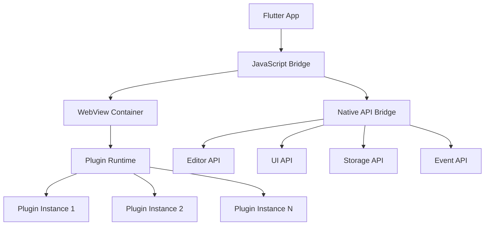

# JavaScript 插件动态加载架构设计

## 概述

基于 Flutter WebView 和 JavaScript 引擎，实现完全动态的插件加载系统，支持运行时插件安装、卸载和热更新。

## 核心架构

### 1. JavaScript 引擎集成

#### 1.1 WebView 桥接架构



#### 1.2 Flutter 端实现

```dart
// lib/core/plugin_engine/js_engine.dart
import 'package:webview_flutter/webview_flutter.dart';

class JavaScriptPluginEngine {
  late WebViewController _webViewController;
  final Map<String, JavaScriptPlugin> _loadedPlugins = {};
  final PluginAPIBridge _apiBridge = PluginAPIBridge();
  
  Future<void> initialize() async {
    _webViewController = WebViewController()
      ..setJavaScriptMode(JavaScriptMode.unrestricted)
      ..addJavaScriptChannel(
        'PluginAPI',
        onMessageReceived: _handleJavaScriptMessage,
      )
      ..loadHtmlString(_generateRuntimeHTML());
    
    // 初始化 API 桥接
    await _apiBridge.initialize(_webViewController);
  }

  Future<void> loadPlugin(String pluginId, String jsCode) async {
    try {
      // 在隔离的命名空间中加载插件
      final wrappedCode = _wrapPluginCode(pluginId, jsCode);
      
      await _webViewController.runJavaScript(wrappedCode);
      
      // 激活插件
      await _activatePlugin(pluginId);
      
      _loadedPlugins[pluginId] = JavaScriptPlugin(
        id: pluginId,
        isActive: true,
        controller: _webViewController,
      );
      
    } catch (e) {
      throw PluginLoadException('Failed to load JavaScript plugin $pluginId: $e');
    }
  }

  Future<void> unloadPlugin(String pluginId) async {
    final plugin = _loadedPlugins[pluginId];
    if (plugin == null) return;
    
    try {
      // 调用插件的 deactivate 方法
      await _webViewController.runJavaScript(
        'if (window.plugins["$pluginId"] && window.plugins["$pluginId"].deactivate) {'
        '  window.plugins["$pluginId"].deactivate();'
        '}'
      );
      
      // 清理插件命名空间
      await _webViewController.runJavaScript(
        'delete window.plugins["$pluginId"];'
      );
      
      _loadedPlugins.remove(pluginId);
      
    } catch (e) {
      throw PluginUnloadException('Failed to unload JavaScript plugin $pluginId: $e');
    }
  }

  void _handleJavaScriptMessage(JavaScriptMessage message) {
    try {
      final data = jsonDecode(message.message);
      _apiBridge.handleAPICall(data);
    } catch (e) {
      print('Error handling JavaScript message: $e');
    }
  }

  String _wrapPluginCode(String pluginId, String jsCode) {
    return '''
    (function() {
      // 创建插件命名空间
      if (!window.plugins) window.plugins = {};
      if (!window.pluginAPI) window.pluginAPI = {};
      
      // 插件 API 实例
      const api = new MarkoraPluginAPI('$pluginId');
      
      // 插件上下文
      const context = {
        pluginId: '$pluginId',
        api: api,
        require: function(module) {
          return window.pluginModules[module];
        }
      };
      
      // 执行插件代码
      try {
        const plugin = (function() {
          $jsCode
          
          // 返回插件导出对象
          if (typeof activate === 'function') {
            return {
              activate: activate,
              deactivate: typeof deactivate === 'function' ? deactivate : function() {}
            };
          }
          throw new Error('Plugin must export activate function');
        })();
        
        // 保存插件实例
        window.plugins['$pluginId'] = plugin;
        
        return true;
      } catch (error) {
        console.error('Plugin $pluginId load error:', error);
        throw error;
      }
    })();
    ''';
  }

  Future<void> _activatePlugin(String pluginId) async {
    await _webViewController.runJavaScript('''
      if (window.plugins["$pluginId"] && window.plugins["$pluginId"].activate) {
        const context = {
          pluginId: "$pluginId",
          api: new MarkoraPluginAPI("$pluginId")
        };
        window.plugins["$pluginId"].activate(context);
      }
    ''');
  }

  String _generateRuntimeHTML() {
    return '''
    <!DOCTYPE html>
    <html>
    <head>
      <meta charset="UTF-8">
      <meta name="viewport" content="width=device-width, initial-scale=1.0">
      <title>Plugin Runtime</title>
    </head>
    <body>
      <script>
        // Plugin runtime initialization
        ${_getPluginAPIScript()}
        
        // Plugin modules registry
        window.pluginModules = {};
        
        // Plugin registry
        window.plugins = {};
        
        console.log('Plugin runtime initialized');
      </script>
    </body>
    </html>
    ''';
  }
}
```

#### 1.3 API 桥接实现

```dart
// lib/core/plugin_engine/api_bridge.dart
class PluginAPIBridge {
  late WebViewController _controller;
  final Map<String, Function> _apiHandlers = {};

  Future<void> initialize(WebViewController controller) async {
    _controller = controller;
    _registerAPIHandlers();
  }

  void _registerAPIHandlers() {
    // 编辑器 API
    _apiHandlers['editor.getContent'] = () async {
      final content = await EditorService().getCurrentContent();
      return {'success': true, 'data': content};
    };
    
    _apiHandlers['editor.setContent'] = (Map<String, dynamic> params) async {
      final content = params['content'] as String;
      await EditorService().setContent(content);
      return {'success': true};
    };
    
    _apiHandlers['editor.insertText'] = (Map<String, dynamic> params) async {
      final text = params['text'] as String;
      await EditorService().insertText(text);
      return {'success': true};
    };
    
    // UI API
    _apiHandlers['ui.showNotification'] = (Map<String, dynamic> params) async {
      final message = params['message'] as String;
      final type = params['type'] as String;
      await UIService().showNotification(message, type);
      return {'success': true};
    };
    
    _apiHandlers['ui.registerCommand'] = (Map<String, dynamic> params) async {
      final pluginId = params['pluginId'] as String;
      final commandId = params['commandId'] as String;
      final title = params['title'] as String;
      
      await CommandRegistry().registerCommand(
        pluginId: pluginId,
        commandId: commandId,
        title: title,
        handler: () => _executePluginCommand(pluginId, commandId),
      );
      
      return {'success': true};
    };
    
    // 存储 API
    _apiHandlers['storage.get'] = (Map<String, dynamic> params) async {
      final pluginId = params['pluginId'] as String;
      final key = params['key'] as String;
      final value = await PluginStorage().get(pluginId, key);
      return {'success': true, 'data': value};
    };
    
    _apiHandlers['storage.set'] = (Map<String, dynamic> params) async {
      final pluginId = params['pluginId'] as String;
      final key = params['key'] as String;
      final value = params['value'];
      await PluginStorage().set(pluginId, key, value);
      return {'success': true};
    };
  }

  Future<void> handleAPICall(Map<String, dynamic> data) async {
    final method = data['method'] as String;
    final params = data['params'] as Map<String, dynamic>? ?? {};
    final callId = data['callId'] as String;
    
    try {
      final handler = _apiHandlers[method];
      if (handler == null) {
        throw Exception('Unknown API method: $method');
      }
      
      final result = await handler(params);
      
      // 返回结果给 JavaScript
      await _controller.runJavaScript('''
        if (window.pluginAPICallbacks["$callId"]) {
          window.pluginAPICallbacks["$callId"].resolve(${jsonEncode(result)});
          delete window.pluginAPICallbacks["$callId"];
        }
      ''');
      
    } catch (e) {
      // 返回错误给 JavaScript
      await _controller.runJavaScript('''
        if (window.pluginAPICallbacks["$callId"]) {
          window.pluginAPICallbacks["$callId"].reject({
            error: true,
            message: "${e.toString()}"
          });
          delete window.pluginAPICallbacks["$callId"];
        }
      ''');
    }
  }

  Future<void> _executePluginCommand(String pluginId, String commandId) async {
    await _controller.runJavaScript('''
      if (window.plugins["$pluginId"] && window.plugins["$pluginId"].executeCommand) {
        window.plugins["$pluginId"].executeCommand("$commandId");
      }
    ''');
  }
}
```

### 2. JavaScript 插件 API

#### 2.1 核心 API 类

```javascript
// JavaScript 端插件 API
class MarkoraPluginAPI {
  constructor(pluginId) {
    this.pluginId = pluginId;
    this._callId = 0;
    
    // 初始化回调注册表
    if (!window.pluginAPICallbacks) {
      window.pluginAPICallbacks = {};
    }
  }

  // 异步 API 调用
  async _callAPI(method, params = {}) {
    return new Promise((resolve, reject) => {
      const callId = `${this.pluginId}_${++this._callId}`;
      
      // 注册回调
      window.pluginAPICallbacks[callId] = { resolve, reject };
      
      // 发送消息给 Flutter
      const message = {
        method,
        params: { ...params, pluginId: this.pluginId },
        callId
      };
      
      PluginAPI.postMessage(JSON.stringify(message));
      
      // 设置超时
      setTimeout(() => {
        if (window.pluginAPICallbacks[callId]) {
          delete window.pluginAPICallbacks[callId];
          reject(new Error('API call timeout'));
        }
      }, 10000);
    });
  }

  // 编辑器 API
  get editor() {
    return {
      getContent: async () => {
        const result = await this._callAPI('editor.getContent');
        return result.data;
      },
      
      setContent: async (content) => {
        await this._callAPI('editor.setContent', { content });
      },
      
      insertText: async (text) => {
        await this._callAPI('editor.insertText', { text });
      },
      
      getSelection: async () => {
        const result = await this._callAPI('editor.getSelection');
        return result.data;
      },
      
      replaceSelection: async (text) => {
        await this._callAPI('editor.replaceSelection', { text });
      }
    };
  }

  // UI API
  get ui() {
    return {
      showNotification: async (message, type = 'info') => {
        await this._callAPI('ui.showNotification', { message, type });
      },
      
      registerCommand: async (commandId, title, handler) => {
        await this._callAPI('ui.registerCommand', { commandId, title });
        
        // 保存命令处理器
        if (!this._commandHandlers) this._commandHandlers = {};
        this._commandHandlers[commandId] = handler;
      },
      
      addToolbarItem: async (item) => {
        await this._callAPI('ui.addToolbarItem', item);
      },
      
      showQuickPick: async (options) => {
        const result = await this._callAPI('ui.showQuickPick', options);
        return result.data;
      },
      
      showInputBox: async (options) => {
        const result = await this._callAPI('ui.showInputBox', options);
        return result.data;
      },
      
      createWebView: async (options) => {
        const result = await this._callAPI('ui.createWebView', options);
        return new PluginWebView(result.data.id, this);
      }
    };
  }

  // 存储 API
  get storage() {
    return {
      get: async (key) => {
        const result = await this._callAPI('storage.get', { key });
        return result.data;
      },
      
      set: async (key, value) => {
        await this._callAPI('storage.set', { key, value });
      },
      
      remove: async (key) => {
        await this._callAPI('storage.remove', { key });
      },
      
      keys: async () => {
        const result = await this._callAPI('storage.keys');
        return result.data;
      }
    };
  }

  // 事件 API
  get events() {
    return {
      on: (event, handler) => {
        if (!this._eventHandlers) this._eventHandlers = {};
        if (!this._eventHandlers[event]) this._eventHandlers[event] = [];
        this._eventHandlers[event].push(handler);
      },
      
      off: (event, handler) => {
        if (!this._eventHandlers || !this._eventHandlers[event]) return;
        const index = this._eventHandlers[event].indexOf(handler);
        if (index > -1) {
          this._eventHandlers[event].splice(index, 1);
        }
      },
      
      emit: async (event, data) => {
        await this._callAPI('events.emit', { event, data });
      }
    };
  }

  // 文件系统 API
  get fs() {
    return {
      readFile: async (path) => {
        const result = await this._callAPI('fs.readFile', { path });
        return result.data;
      },
      
      writeFile: async (path, content) => {
        await this._callAPI('fs.writeFile', { path, content });
      },
      
      exists: async (path) => {
        const result = await this._callAPI('fs.exists', { path });
        return result.data;
      },
      
      showOpenDialog: async (options) => {
        const result = await this._callAPI('fs.showOpenDialog', options);
        return result.data;
      },
      
      showSaveDialog: async (options) => {
        const result = await this._callAPI('fs.showSaveDialog', options);
        return result.data;
      }
    };
  }

  // 渲染器 API
  get renderers() {
    return {
      register: async (language, handler) => {
        await this._callAPI('renderers.register', { language });
        
        // 保存渲染器处理器
        if (!this._rendererHandlers) this._rendererHandlers = {};
        this._rendererHandlers[language] = handler;
      },
      
      unregister: async (language) => {
        await this._callAPI('renderers.unregister', { language });
        
        if (this._rendererHandlers) {
          delete this._rendererHandlers[language];
        }
      }
    };
  }

  // 执行命令
  executeCommand(commandId) {
    if (this._commandHandlers && this._commandHandlers[commandId]) {
      this._commandHandlers[commandId]();
    }
  }

  // 渲染内容
  renderContent(language, content) {
    if (this._rendererHandlers && this._rendererHandlers[language]) {
      return this._rendererHandlers[language](content);
    }
    return null;
  }

  // 处理事件
  handleEvent(event, data) {
    if (this._eventHandlers && this._eventHandlers[event]) {
      this._eventHandlers[event].forEach(handler => {
        try {
          handler(data);
        } catch (e) {
          console.error(`Error in event handler for ${event}:`, e);
        }
      });
    }
  }
}

// WebView 包装器
class PluginWebView {
  constructor(id, api) {
    this.id = id;
    this.api = api;
  }

  async postMessage(message) {
    await this.api._callAPI('webview.postMessage', {
      webviewId: this.id,
      message
    });
  }

  async loadHTML(html) {
    await this.api._callAPI('webview.loadHTML', {
      webviewId: this.id,
      html
    });
  }

  async loadURL(url) {
    await this.api._callAPI('webview.loadURL', {
      webviewId: this.id,
      url
    });
  }

  onMessage(handler) {
    this.api.events.on(`webview.message.${this.id}`, handler);
  }
}

// 工具函数
const PluginUtils = {
  // DOM 操作
  createElement: (tag, attributes = {}, children = []) => {
    const element = document.createElement(tag);
    
    Object.entries(attributes).forEach(([key, value]) => {
      element.setAttribute(key, value);
    });
    
    children.forEach(child => {
      if (typeof child === 'string') {
        element.appendChild(document.createTextNode(child));
      } else {
        element.appendChild(child);
      }
    });
    
    return element;
  },
  
  // 事件处理
  debounce: (func, wait) => {
    let timeout;
    return function executedFunction(...args) {
      const later = () => {
        clearTimeout(timeout);
        func(...args);
      };
      clearTimeout(timeout);
      timeout = setTimeout(later, wait);
    };
  },
  
  // 异步操作
  timeout: (ms) => new Promise(resolve => setTimeout(resolve, ms)),
  
  // 数据处理
  deepClone: (obj) => JSON.parse(JSON.stringify(obj)),
  
  // 模板引擎
  template: (template, data) => {
    return template.replace(/\{\{(\w+)\}\}/g, (match, key) => {
      return data[key] || match;
    });
  }
};

// 全局暴露
window.MarkoraPluginAPI = MarkoraPluginAPI;
window.PluginWebView = PluginWebView;
window.PluginUtils = PluginUtils;
```

### 3. 插件生命周期管理

#### 3.1 生命周期钩子

```javascript
// 插件生命周期示例
class ExamplePlugin {
  constructor() {
    this.isActive = false;
    this.api = null;
    this.subscriptions = [];
  }

  // 插件激活
  async activate(context) {
    this.api = context.api;
    this.isActive = true;
    
    console.log(`Plugin ${context.pluginId} activated`);
    
    // 注册命令
    await this.registerCommands();
    
    // 注册事件监听器
    this.registerEventListeners();
    
    // 初始化插件状态
    await this.initializeState();
    
    // 注册清理函数
    this.subscriptions.push(() => this.cleanup());
  }

  // 插件停用
  async deactivate() {
    console.log('Plugin deactivating...');
    
    // 执行清理操作
    this.subscriptions.forEach(cleanup => cleanup());
    this.subscriptions = [];
    
    this.isActive = false;
    this.api = null;
  }

  async registerCommands() {
    await this.api.ui.registerCommand(
      'example.hello',
      'Hello World',
      () => this.sayHello()
    );
    
    await this.api.ui.addToolbarItem({
      id: 'example.hello',
      icon: 'heart',
      tooltip: 'Say Hello',
      command: 'example.hello'
    });
  }

  registerEventListeners() {
    // 监听编辑器变化
    this.api.events.on('editor.contentChanged', (data) => {
      this.onContentChanged(data);
    });
    
    // 监听文件变化
    this.api.events.on('file.opened', (data) => {
      this.onFileOpened(data);
    });
  }

  async initializeState() {
    // 从存储中恢复状态
    const savedState = await this.api.storage.get('pluginState');
    if (savedState) {
      this.restoreState(savedState);
    }
  }

  async sayHello() {
    const name = await this.api.ui.showInputBox({
      placeholder: 'Enter your name',
      prompt: 'What is your name?'
    });
    
    if (name) {
      await this.api.ui.showNotification(
        `Hello, ${name}!`,
        'info'
      );
    }
  }

  onContentChanged(data) {
    // 处理内容变化
    console.log('Content changed:', data);
  }

  onFileOpened(data) {
    // 处理文件打开
    console.log('File opened:', data);
  }

  restoreState(state) {
    // 恢复插件状态
    console.log('Restoring plugin state:', state);
  }

  cleanup() {
    // 清理资源
    console.log('Cleaning up plugin resources');
  }
}

// 插件入口点
function activate(context) {
  const plugin = new ExamplePlugin();
  plugin.activate(context);
  return plugin;
}

function deactivate() {
  // 全局清理
}
```

### 4. 模块系统和依赖管理

#### 4.1 模块加载器

```javascript
// 插件模块系统
class PluginModuleLoader {
  constructor() {
    this.modules = new Map();
    this.dependencies = new Map();
  }

  // 注册模块
  register(name, module) {
    this.modules.set(name, module);
  }

  // 加载模块
  require(name) {
    if (this.modules.has(name)) {
      return this.modules.get(name);
    }
    
    throw new Error(`Module '${name}' not found`);
  }

  // 动态加载模块
  async loadModule(name, url) {
    try {
      const response = await fetch(url);
      const code = await response.text();
      
      // 在安全环境中执行模块代码
      const module = this.evaluateModule(code);
      this.register(name, module);
      
      return module;
    } catch (error) {
      throw new Error(`Failed to load module '${name}': ${error.message}`);
    }
  }

  evaluateModule(code) {
    // 创建模块环境
    const moduleEnv = {
      exports: {},
      module: { exports: {} },
      require: (name) => this.require(name),
      console: console,
      setTimeout: setTimeout,
      setInterval: setInterval,
      clearTimeout: clearTimeout,
      clearInterval: clearInterval
    };

    // 执行模块代码
    const func = new Function(
      'exports', 'module', 'require', 'console',
      'setTimeout', 'setInterval', 'clearTimeout', 'clearInterval',
      code
    );

    func(
      moduleEnv.exports,
      moduleEnv.module,
      moduleEnv.require,
      moduleEnv.console,
      moduleEnv.setTimeout,
      moduleEnv.setInterval,
      moduleEnv.clearTimeout,
      moduleEnv.clearInterval
    );

    return moduleEnv.module.exports || moduleEnv.exports;
  }

  // 检查依赖
  checkDependencies(pluginManifest) {
    const required = pluginManifest.dependencies || {};
    const missing = [];

    Object.keys(required).forEach(dep => {
      if (!this.modules.has(dep)) {
        missing.push(dep);
      }
    });

    return missing;
  }
}

// 全局模块加载器
window.pluginModuleLoader = new PluginModuleLoader();

// 注册核心模块
window.pluginModuleLoader.register('markdown', {
  parse: (content) => {
    // Markdown 解析功能
    return content;
  },
  render: (ast) => {
    // 渲染功能
    return ast;
  }
});

window.pluginModuleLoader.register('utils', PluginUtils);
```

### 5. 安全沙箱

#### 5.1 沙箱环境

```javascript
// 插件安全沙箱
class PluginSandbox {
  constructor(pluginId) {
    this.pluginId = pluginId;
    this.allowedAPIs = new Set([
      'console.log',
      'console.error',
      'setTimeout',
      'setInterval',
      'clearTimeout',
      'clearInterval',
      'JSON.parse',
      'JSON.stringify',
      'Math',
      'Date'
    ]);
  }

  // 创建沙箱环境
  createSandbox() {
    const sandbox = {
      // 允许的全局对象
      console: {
        log: (...args) => console.log(`[${this.pluginId}]`, ...args),
        error: (...args) => console.error(`[${this.pluginId}]`, ...args),
        warn: (...args) => console.warn(`[${this.pluginId}]`, ...args)
      },
      
      setTimeout: window.setTimeout,
      setInterval: window.setInterval,
      clearTimeout: window.clearTimeout,
      clearInterval: window.clearInterval,
      
      JSON: window.JSON,
      Math: window.Math,
      Date: window.Date,
      
      // 插件 API
      MarkoraPluginAPI: window.MarkoraPluginAPI,
      PluginUtils: window.PluginUtils,
      
      // 模块系统
      require: (name) => window.pluginModuleLoader.require(name),
      
      // 禁止访问的对象
      window: undefined,
      document: undefined,
      eval: undefined,
      Function: undefined,
      XMLHttpRequest: undefined,
      fetch: undefined
    };

    return sandbox;
  }

  // 在沙箱中执行代码
  executeInSandbox(code) {
    const sandbox = this.createSandbox();
    
    try {
      // 创建函数并在沙箱中执行
      const func = new Function(
        ...Object.keys(sandbox),
        `
        "use strict";
        ${code}
        `
      );
      
      return func(...Object.values(sandbox));
    } catch (error) {
      throw new Error(`Sandbox execution error: ${error.message}`);
    }
  }
}
```

### 6. 错误处理和调试

#### 6.1 错误捕获和报告

```javascript
// 插件错误处理系统
class PluginErrorHandler {
  constructor(pluginId) {
    this.pluginId = pluginId;
    this.errors = [];
  }

  // 捕获错误
  captureError(error, context = {}) {
    const errorInfo = {
      pluginId: this.pluginId,
      message: error.message,
      stack: error.stack,
      timestamp: Date.now(),
      context: context
    };

    this.errors.push(errorInfo);
    
    // 报告给主程序
    this.reportError(errorInfo);
  }

  // 报告错误给主程序
  async reportError(errorInfo) {
    try {
      await this._callAPI('plugin.reportError', errorInfo);
    } catch (e) {
      console.error('Failed to report plugin error:', e);
    }
  }

  // 获取错误历史
  getErrors() {
    return this.errors;
  }

  // 清除错误
  clearErrors() {
    this.errors = [];
  }
}

// 全局错误处理
window.addEventListener('error', (event) => {
  console.error('Global error in plugin runtime:', event.error);
});

window.addEventListener('unhandledrejection', (event) => {
  console.error('Unhandled promise rejection in plugin runtime:', event.reason);
});
```

## 性能优化

### 1. 内存管理

```javascript
// 内存管理工具
class PluginMemoryManager {
  constructor() {
    this.allocations = new Map();
    this.limits = {
      maxMemory: 100 * 1024 * 1024, // 100MB
      maxObjects: 10000
    };
  }

  // 跟踪内存分配
  track(pluginId, objectType, size) {
    if (!this.allocations.has(pluginId)) {
      this.allocations.set(pluginId, {
        total: 0,
        objects: 0,
        types: new Map()
      });
    }

    const allocation = this.allocations.get(pluginId);
    allocation.total += size;
    allocation.objects += 1;
    
    if (!allocation.types.has(objectType)) {
      allocation.types.set(objectType, { count: 0, size: 0 });
    }
    
    const typeInfo = allocation.types.get(objectType);
    typeInfo.count += 1;
    typeInfo.size += size;

    // 检查限制
    this.checkLimits(pluginId);
  }

  // 检查内存限制
  checkLimits(pluginId) {
    const allocation = this.allocations.get(pluginId);
    if (!allocation) return;

    if (allocation.total > this.limits.maxMemory) {
      throw new Error(`Plugin ${pluginId} exceeded memory limit`);
    }

    if (allocation.objects > this.limits.maxObjects) {
      throw new Error(`Plugin ${pluginId} exceeded object limit`);
    }
  }

  // 获取内存使用情况
  getUsage(pluginId) {
    return this.allocations.get(pluginId) || { total: 0, objects: 0, types: new Map() };
  }
}
```

### 2. 缓存策略

```javascript
// 插件缓存系统
class PluginCache {
  constructor(maxSize = 50) {
    this.cache = new Map();
    this.maxSize = maxSize;
    this.accessOrder = [];
  }

  // 获取缓存
  get(key) {
    if (this.cache.has(key)) {
      // 更新访问顺序
      this.updateAccessOrder(key);
      return this.cache.get(key);
    }
    return null;
  }

  // 设置缓存
  set(key, value) {
    if (this.cache.has(key)) {
      this.cache.set(key, value);
      this.updateAccessOrder(key);
    } else {
      // 检查容量
      if (this.cache.size >= this.maxSize) {
        this.evictLRU();
      }
      
      this.cache.set(key, value);
      this.accessOrder.push(key);
    }
  }

  // 更新访问顺序
  updateAccessOrder(key) {
    const index = this.accessOrder.indexOf(key);
    if (index > -1) {
      this.accessOrder.splice(index, 1);
    }
    this.accessOrder.push(key);
  }

  // LRU 淘汰
  evictLRU() {
    const lruKey = this.accessOrder.shift();
    if (lruKey) {
      this.cache.delete(lruKey);
    }
  }

  // 清除缓存
  clear() {
    this.cache.clear();
    this.accessOrder = [];
  }
}
```

### 3. 性能监控

```javascript
// 性能监控器
class PluginPerformanceMonitor {
  constructor(pluginId) {
    this.pluginId = pluginId;
    this.metrics = {
      apiCalls: {},
      executionTimes: {},
      memoryUsage: [],
      errors: []
    };
  }

  // 记录 API 调用
  recordAPICall(method, duration) {
    if (!this.metrics.apiCalls[method]) {
      this.metrics.apiCalls[method] = {
        count: 0,
        totalTime: 0,
        avgTime: 0
      };
    }

    const metric = this.metrics.apiCalls[method];
    metric.count += 1;
    metric.totalTime += duration;
    metric.avgTime = metric.totalTime / metric.count;
  }

  // 记录执行时间
  recordExecution(operation, duration) {
    if (!this.metrics.executionTimes[operation]) {
      this.metrics.executionTimes[operation] = [];
    }
    
    this.metrics.executionTimes[operation].push({
      duration,
      timestamp: Date.now()
    });
  }

  // 记录内存使用
  recordMemoryUsage() {
    if (performance.memory) {
      this.metrics.memoryUsage.push({
        used: performance.memory.usedJSHeapSize,
        total: performance.memory.totalJSHeapSize,
        timestamp: Date.now()
      });
    }
  }

  // 获取性能报告
  getReport() {
    return {
      pluginId: this.pluginId,
      timestamp: Date.now(),
      ...this.metrics
    };
  }
}
```

## 调试工具

### 1. 开发者工具

```javascript
// 插件开发者工具
class PluginDevTools {
  constructor() {
    this.isEnabled = false;
    this.logLevel = 'info';
    this.breakpoints = new Set();
  }

  // 启用开发者模式
  enable() {
    this.isEnabled = true;
    this.injectDebugger();
  }

  // 注入调试器
  injectDebugger() {
    // 注入日志拦截器
    const originalLog = console.log;
    console.log = (...args) => {
      if (this.isEnabled) {
        this.captureLog('log', args);
      }
      originalLog.apply(console, args);
    };

    // 注入性能监控
    const originalFetch = window.fetch;
    window.fetch = async (...args) => {
      const start = performance.now();
      const result = await originalFetch.apply(window, args);
      const duration = performance.now() - start;
      
      if (this.isEnabled) {
        this.recordNetworkCall(args[0], duration);
      }
      
      return result;
    };
  }

  // 捕获日志
  captureLog(level, args) {
    // 发送到开发者控制台
    this.sendToDevConsole({
      type: 'log',
      level,
      args,
      timestamp: Date.now(),
      stack: new Error().stack
    });
  }

  // 记录网络调用
  recordNetworkCall(url, duration) {
    this.sendToDevConsole({
      type: 'network',
      url,
      duration,
      timestamp: Date.now()
    });
  }

  // 发送到开发者控制台
  sendToDevConsole(data) {
    // 通过 PostMessage 发送到 Flutter 端的开发者工具
    if (window.PluginAPI) {
      PluginAPI.postMessage(JSON.stringify({
        type: 'devtools',
        data
      }));
    }
  }

  // 设置断点
  setBreakpoint(file, line) {
    this.breakpoints.add(`${file}:${line}`);
  }

  // 移除断点
  removeBreakpoint(file, line) {
    this.breakpoints.delete(`${file}:${line}`);
  }
}

// 全局开发者工具实例
window.pluginDevTools = new PluginDevTools();
```

这个 JavaScript 插件运行时架构提供了完整的动态加载能力，支持插件的热插拔、错误隔离、性能监控和调试功能，为 Markora 插件系统提供了强大的扩展性。