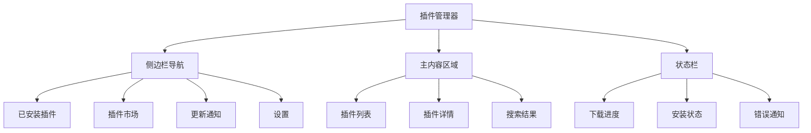

# 插件管理界面设计方案

## 概述

基于 VS Code 扩展管理器的设计理念，为 Markora 设计一套直观、功能完整的插件管理界面，支持插件的浏览、安装、配置和管理。

## 界面架构

### 1. 主界面布局



### 2. Flutter UI 实现

#### 2.1 主插件管理页面

```dart
// lib/features/plugins/presentation/pages/plugin_management_page.dart
class PluginManagementPage extends ConsumerStatefulWidget {
  const PluginManagementPage({super.key});

  @override
  ConsumerState<PluginManagementPage> createState() => _PluginManagementPageState();
}

class _PluginManagementPageState extends ConsumerState<PluginManagementPage>
    with TickerProviderStateMixin {
  late TabController _tabController;
  final TextEditingController _searchController = TextEditingController();
  
  @override
  void initState() {
    super.initState();
    _tabController = TabController(length: 4, vsync: this);
  }

  @override
  Widget build(BuildContext context) {
    return Scaffold(
      appBar: AppBar(
        title: const Text('Plugin Manager'),
        bottom: PreferredSize(
          preferredSize: const Size.fromHeight(120),
          child: Column(
            children: [
              // 搜索栏
              Padding(
                padding: const EdgeInsets.all(16.0),
                child: PluginSearchBar(
                  controller: _searchController,
                  onSearch: _handleSearch,
                ),
              ),
              // 标签栏
              TabBar(
                controller: _tabController,
                tabs: const [
                  Tab(icon: Icon(PhosphorIcons.package), text: 'Installed'),
                  Tab(icon: Icon(PhosphorIcons.storefront), text: 'Marketplace'),
                  Tab(icon: Icon(PhosphorIcons.downloadSimple), text: 'Updates'),
                  Tab(icon: Icon(PhosphorIcons.gear), text: 'Settings'),
                ],
              ),
            ],
          ),
        ),
      ),
      body: TabBarView(
        controller: _tabController,
        children: [
          InstalledPluginsTab(),
          PluginMarketplaceTab(),
          PluginUpdatesTab(),
          PluginSettingsTab(),
        ],
      ),
    );
  }

  void _handleSearch(String query) {
    ref.read(pluginSearchProvider.notifier).search(query);
  }
}
```

#### 2.2 已安装插件标签页

```dart
// lib/features/plugins/presentation/widgets/installed_plugins_tab.dart
class InstalledPluginsTab extends ConsumerWidget {
  const InstalledPluginsTab({super.key});

  @override
  Widget build(BuildContext context, WidgetRef ref) {
    final installedPlugins = ref.watch(installedPluginsProvider);
    final platformManager = ref.watch(platformManagerProvider);
    
    return installedPlugins.when(
      data: (plugins) {
        if (plugins.isEmpty) {
          return const EmptyPluginsView(
            message: 'No plugins installed',
            actionText: 'Browse Marketplace',
          );
        }
        
        // 按类别分组
        final groupedPlugins = _groupPluginsByCategory(plugins);
        
        return ListView.builder(
          padding: const EdgeInsets.all(16),
          itemCount: groupedPlugins.length,
          itemBuilder: (context, index) {
            final category = groupedPlugins.keys.elementAt(index);
            final categoryPlugins = groupedPlugins[category]!;
            
            return PluginCategorySection(
              category: category,
              plugins: categoryPlugins,
              platformManager: platformManager,
            );
          },
        );
      },
      loading: () => const Center(child: CircularProgressIndicator()),
      error: (error, stack) => ErrorView(
        error: error,
        onRetry: () => ref.refresh(installedPluginsProvider),
      ),
    );
  }

  Map<String, List<PluginPackage>> _groupPluginsByCategory(
    List<PluginPackage> plugins,
  ) {
    final grouped = <String, List<PluginPackage>>{};
    
    for (final plugin in plugins) {
      final category = plugin.metadata.category;
      grouped.putIfAbsent(category, () => []).add(plugin);
    }
    
    return grouped;
  }
}
```

#### 2.3 插件卡片组件

```dart
// lib/features/plugins/presentation/widgets/plugin_card.dart
class PluginCard extends ConsumerWidget {
  const PluginCard({
    super.key,
    required this.plugin,
    required this.isCompatible,
    this.incompatibilityReasons = const [],
    this.showActions = true,
  });

  final PluginPackage plugin;
  final bool isCompatible;
  final List<String> incompatibilityReasons;
  final bool showActions;

  @override
  Widget build(BuildContext context, WidgetRef ref) {
    final theme = Theme.of(context);
    final pluginState = ref.watch(pluginStateProvider(plugin.metadata.id));
    
    return Card(
      margin: const EdgeInsets.only(bottom: 12),
      child: InkWell(
        onTap: () => _showPluginDetails(context, ref),
        borderRadius: BorderRadius.circular(12),
        child: Padding(
          padding: const EdgeInsets.all(16),
          child: Column(
            crossAxisAlignment: CrossAxisAlignment.start,
            children: [
              // 头部信息
              Row(
                children: [
                  // 插件图标
                  PluginIcon(
                    iconPath: plugin.metadata.icon,
                    size: 48,
                  ),
                  const SizedBox(width: 12),
                  // 基本信息
                  Expanded(
                    child: Column(
                      crossAxisAlignment: CrossAxisAlignment.start,
                      children: [
                        Row(
                          children: [
                            Expanded(
                              child: Text(
                                plugin.metadata.name,
                                style: theme.textTheme.titleMedium?.copyWith(
                                  fontWeight: FontWeight.w600,
                                  color: isCompatible 
                                    ? null 
                                    : theme.colorScheme.onSurface.withOpacity(0.6),
                                ),
                              ),
                            ),
                            // 版本号
                            Container(
                              padding: const EdgeInsets.symmetric(
                                horizontal: 8,
                                vertical: 4,
                              ),
                              decoration: BoxDecoration(
                                color: theme.colorScheme.surfaceVariant,
                                borderRadius: BorderRadius.circular(4),
                              ),
                              child: Text(
                                'v${plugin.metadata.version}',
                                style: theme.textTheme.labelSmall,
                              ),
                            ),
                          ],
                        ),
                        const SizedBox(height: 4),
                        Text(
                          plugin.metadata.description,
                          style: theme.textTheme.bodySmall?.copyWith(
                            color: theme.colorScheme.onSurface.withOpacity(0.7),
                          ),
                          maxLines: 2,
                          overflow: TextOverflow.ellipsis,
                        ),
                        const SizedBox(height: 8),
                        // 作者信息
                        Row(
                          children: [
                            Icon(
                              PhosphorIcons.user,
                              size: 14,
                              color: theme.colorScheme.onSurface.withOpacity(0.6),
                            ),
                            const SizedBox(width: 4),
                            Text(
                              plugin.metadata.author,
                              style: theme.textTheme.labelSmall?.copyWith(
                                color: theme.colorScheme.onSurface.withOpacity(0.6),
                              ),
                            ),
                          ],
                        ),
                      ],
                    ),
                  ),
                  // 状态指示器
                  PluginStatusIndicator(
                    status: pluginState.status,
                    isCompatible: isCompatible,
                  ),
                ],
              ),
              
              const SizedBox(height: 12),
              
              // 平台兼容性标签
              PlatformCompatibilityBadges(
                platforms: plugin.metadata.platforms,
              ),
              
              if (!isCompatible) ...[
                const SizedBox(height: 12),
                IncompatibilityWarning(
                  reasons: incompatibilityReasons,
                ),
              ],
              
              if (showActions) ...[
                const SizedBox(height: 12),
                // 操作按钮
                PluginActionButtons(
                  plugin: plugin,
                  isCompatible: isCompatible,
                  status: pluginState.status,
                ),
              ],
            ],
          ),
        ),
      ),
    );
  }

  void _showPluginDetails(BuildContext context, WidgetRef ref) {
    showModalBottomSheet(
      context: context,
      isScrollControlled: true,
      backgroundColor: Colors.transparent,
      builder: (context) => PluginDetailsSheet(plugin: plugin),
    );
  }
}
```

#### 2.4 插件详情页面

```dart
// lib/features/plugins/presentation/widgets/plugin_details_sheet.dart
class PluginDetailsSheet extends ConsumerWidget {
  const PluginDetailsSheet({
    super.key,
    required this.plugin,
  });

  final PluginPackage plugin;

  @override
  Widget build(BuildContext context, WidgetRef ref) {
    final theme = Theme.of(context);
    final screenHeight = MediaQuery.of(context).size.height;
    
    return Container(
      height: screenHeight * 0.9,
      decoration: BoxDecoration(
        color: theme.colorScheme.surface,
        borderRadius: const BorderRadius.vertical(
          top: Radius.circular(16),
        ),
      ),
      child: Column(
        children: [
          // 拖拽指示器
          Container(
            margin: const EdgeInsets.symmetric(vertical: 8),
            width: 40,
            height: 4,
            decoration: BoxDecoration(
              color: theme.colorScheme.onSurface.withOpacity(0.3),
              borderRadius: BorderRadius.circular(2),
            ),
          ),
          
          // 头部
          Padding(
            padding: const EdgeInsets.all(16),
            child: Row(
              children: [
                PluginIcon(
                  iconPath: plugin.metadata.icon,
                  size: 64,
                ),
                const SizedBox(width: 16),
                Expanded(
                  child: Column(
                    crossAxisAlignment: CrossAxisAlignment.start,
                    children: [
                      Text(
                        plugin.metadata.name,
                        style: theme.textTheme.headlineSmall,
                      ),
                      const SizedBox(height: 4),
                      Text(
                        'by ${plugin.metadata.author}',
                        style: theme.textTheme.bodyMedium?.copyWith(
                          color: theme.colorScheme.onSurface.withOpacity(0.7),
                        ),
                      ),
                      const SizedBox(height: 8),
                      Row(
                        children: [
                          PluginRatingStars(
                            rating: plugin.metadata.rating ?? 0,
                            size: 16,
                          ),
                          const SizedBox(width: 8),
                          Text(
                            '${plugin.metadata.downloadCount ?? 0} downloads',
                            style: theme.textTheme.labelSmall,
                          ),
                        ],
                      ),
                    ],
                  ),
                ),
                IconButton(
                  onPressed: () => Navigator.of(context).pop(),
                  icon: const Icon(PhosphorIcons.x),
                ),
              ],
            ),
          ),
          
          // 内容区域
          Expanded(
            child: DefaultTabController(
              length: 4,
              child: Column(
                children: [
                  TabBar(
                    tabs: const [
                      Tab(text: 'Overview'),
                      Tab(text: 'Changelog'),
                      Tab(text: 'Reviews'),
                      Tab(text: 'Settings'),
                    ],
                  ),
                  Expanded(
                    child: TabBarView(
                      children: [
                        PluginOverviewTab(plugin: plugin),
                        PluginChangelogTab(plugin: plugin),
                        PluginReviewsTab(plugin: plugin),
                        PluginSettingsTab(plugin: plugin),
                      ],
                    ),
                  ),
                ],
              ),
            ),
          ),
          
          // 底部操作栏
          PluginDetailsActions(plugin: plugin),
        ],
      ),
    );
  }
}
```

#### 2.5 插件市场标签页

```dart
// lib/features/plugins/presentation/widgets/plugin_marketplace_tab.dart
class PluginMarketplaceTab extends ConsumerStatefulWidget {
  const PluginMarketplaceTab({super.key});

  @override
  ConsumerState<PluginMarketplaceTab> createState() => _PluginMarketplaceTabState();
}

class _PluginMarketplaceTabState extends ConsumerState<PluginMarketplaceTab> {
  String _selectedCategory = 'all';
  String _sortBy = 'popularity';

  @override
  Widget build(BuildContext context) {
    final marketplacePlugins = ref.watch(marketplacePluginsProvider);
    final categories = ref.watch(pluginCategoriesProvider);
    
    return Column(
      children: [
        // 过滤和排序栏
        Container(
          padding: const EdgeInsets.all(16),
          child: Row(
            children: [
              // 分类过滤器
              Expanded(
                child: PluginCategoryFilter(
                  categories: categories,
                  selectedCategory: _selectedCategory,
                  onCategoryChanged: (category) {
                    setState(() {
                      _selectedCategory = category;
                    });
                  },
                ),
              ),
              const SizedBox(width: 16),
              // 排序选择器
              PluginSortSelector(
                sortBy: _sortBy,
                onSortChanged: (sortBy) {
                  setState(() {
                    _sortBy = sortBy;
                  });
                },
              ),
            ],
          ),
        ),
        
        // 插件列表
        Expanded(
          child: marketplacePlugins.when(
            data: (plugins) {
              final filteredPlugins = _filterAndSortPlugins(plugins);
              
              if (filteredPlugins.isEmpty) {
                return EmptyPluginsView(
                  message: 'No plugins found',
                  actionText: 'Clear Filters',
                  onAction: _clearFilters,
                );
              }
              
              return GridView.builder(
                padding: const EdgeInsets.all(16),
                gridDelegate: const SliverGridDelegateWithFixedCrossAxisCount(
                  crossAxisCount: 2,
                  crossAxisSpacing: 16,
                  mainAxisSpacing: 16,
                  childAspectRatio: 0.8,
                ),
                itemCount: filteredPlugins.length,
                itemBuilder: (context, index) {
                  final plugin = filteredPlugins[index];
                  final platformManager = ref.read(platformManagerProvider);
                  
                  return PluginMarketplaceCard(
                    plugin: plugin,
                    isCompatible: platformManager.isPluginCompatible(plugin.metadata),
                    incompatibilityReasons: platformManager
                        .getIncompatibilityReasons(plugin.metadata),
                  );
                },
              );
            },
            loading: () => const GridLoadingView(),
            error: (error, stack) => ErrorView(
              error: error,
              onRetry: () => ref.refresh(marketplacePluginsProvider),
            ),
          ),
        ),
      ],
    );
  }

  List<PluginPackage> _filterAndSortPlugins(List<PluginPackage> plugins) {
    var filtered = plugins;
    
    // 分类过滤
    if (_selectedCategory != 'all') {
      filtered = filtered
          .where((plugin) => plugin.metadata.category == _selectedCategory)
          .toList();
    }
    
    // 排序
    switch (_sortBy) {
      case 'popularity':
        filtered.sort((a, b) => 
          (b.metadata.downloadCount ?? 0).compareTo(a.metadata.downloadCount ?? 0));
        break;
      case 'rating':
        filtered.sort((a, b) => 
          (b.metadata.rating ?? 0.0).compareTo(a.metadata.rating ?? 0.0));
        break;
      case 'recent':
        filtered.sort((a, b) => 
          (b.metadata.publishedAt ?? DateTime(0))
              .compareTo(a.metadata.publishedAt ?? DateTime(0)));
        break;
      case 'name':
        filtered.sort((a, b) => 
          a.metadata.name.toLowerCase().compareTo(b.metadata.name.toLowerCase()));
        break;
    }
    
    return filtered;
  }

  void _clearFilters() {
    setState(() {
      _selectedCategory = 'all';
      _sortBy = 'popularity';
    });
  }
}
```

#### 2.6 插件操作按钮组件

```dart
// lib/features/plugins/presentation/widgets/plugin_action_buttons.dart
class PluginActionButtons extends ConsumerWidget {
  const PluginActionButtons({
    super.key,
    required this.plugin,
    required this.isCompatible,
    required this.status,
  });

  final PluginPackage plugin;
  final bool isCompatible;
  final PluginStatus status;

  @override
  Widget build(BuildContext context, WidgetRef ref) {
    final theme = Theme.of(context);
    
    return Row(
      mainAxisAlignment: MainAxisAlignment.end,
      children: [
        // 主要操作按钮
        _buildPrimaryButton(context, ref, theme),
        
        const SizedBox(width: 8),
        
        // 次要操作按钮
        if (status == PluginStatus.installed) ...[
          IconButton(
            onPressed: () => _showPluginSettings(context, ref),
            icon: const Icon(PhosphorIcons.gear),
            tooltip: 'Settings',
          ),
          
          PopupMenuButton<String>(
            onSelected: (action) => _handleMenuAction(context, ref, action),
            itemBuilder: (context) => [
              const PopupMenuItem(
                value: 'disable',
                child: ListTile(
                  leading: Icon(PhosphorIcons.pause),
                  title: Text('Disable'),
                ),
              ),
              const PopupMenuItem(
                value: 'uninstall',
                child: ListTile(
                  leading: Icon(PhosphorIcons.trash),
                  title: Text('Uninstall'),
                ),
              ),
              const PopupMenuItem(
                value: 'report',
                child: ListTile(
                  leading: Icon(PhosphorIcons.flag),
                  title: Text('Report Issue'),
                ),
              ),
            ],
            icon: const Icon(PhosphorIcons.dotsThreeVertical),
          ),
        ],
      ],
    );
  }

  Widget _buildPrimaryButton(BuildContext context, WidgetRef ref, ThemeData theme) {
    if (!isCompatible) {
      return OutlinedButton(
        onPressed: null,
        child: const Text('Incompatible'),
      );
    }

    switch (status) {
      case PluginStatus.notInstalled:
        return ElevatedButton.icon(
          onPressed: () => _installPlugin(context, ref),
          icon: const Icon(PhosphorIcons.downloadSimple),
          label: const Text('Install'),
        );
        
      case PluginStatus.installing:
        return ElevatedButton.icon(
          onPressed: null,
          icon: SizedBox(
            width: 16,
            height: 16,
            child: CircularProgressIndicator(
              strokeWidth: 2,
              valueColor: AlwaysStoppedAnimation<Color>(
                theme.colorScheme.onPrimary,
              ),
            ),
          ),
          label: const Text('Installing...'),
        );
        
      case PluginStatus.installed:
        return OutlinedButton.icon(
          onPressed: () => _togglePlugin(context, ref),
          icon: const Icon(PhosphorIcons.checkCircle),
          label: const Text('Installed'),
        );
        
      case PluginStatus.disabled:
        return ElevatedButton.icon(
          onPressed: () => _enablePlugin(context, ref),
          icon: const Icon(PhosphorIcons.play),
          label: const Text('Enable'),
        );
        
      case PluginStatus.updateAvailable:
        return ElevatedButton.icon(
          onPressed: () => _updatePlugin(context, ref),
          icon: const Icon(PhosphorIcons.arrowCounterClockwise),
          label: const Text('Update'),
        );
        
      case PluginStatus.error:
        return OutlinedButton.icon(
          onPressed: () => _showErrorDialog(context, ref),
          icon: const Icon(PhosphorIcons.warning),
          label: const Text('Error'),
          style: OutlinedButton.styleFrom(
            foregroundColor: theme.colorScheme.error,
          ),
        );
    }
  }

  Future<void> _installPlugin(BuildContext context, WidgetRef ref) async {
    try {
      await ref.read(pluginManagerProvider.notifier)
          .installPlugin(plugin.metadata.id);
      
      if (context.mounted) {
        ScaffoldMessenger.of(context).showSnackBar(
          SnackBar(
            content: Text('${plugin.metadata.name} installed successfully'),
            action: SnackBarAction(
              label: 'Configure',
              onPressed: () => _showPluginSettings(context, ref),
            ),
          ),
        );
      }
    } catch (e) {
      if (context.mounted) {
        ScaffoldMessenger.of(context).showSnackBar(
          SnackBar(
            content: Text('Failed to install ${plugin.metadata.name}: $e'),
            backgroundColor: Theme.of(context).colorScheme.error,
          ),
        );
      }
    }
  }

  Future<void> _updatePlugin(BuildContext context, WidgetRef ref) async {
    try {
      await ref.read(pluginManagerProvider.notifier)
          .updatePlugin(plugin.metadata.id);
      
      if (context.mounted) {
        ScaffoldMessenger.of(context).showSnackBar(
          SnackBar(
            content: Text('${plugin.metadata.name} updated successfully'),
          ),
        );
      }
    } catch (e) {
      if (context.mounted) {
        ScaffoldMessenger.of(context).showSnackBar(
          SnackBar(
            content: Text('Failed to update ${plugin.metadata.name}: $e'),
            backgroundColor: Theme.of(context).colorScheme.error,
          ),
        );
      }
    }
  }

  Future<void> _togglePlugin(BuildContext context, WidgetRef ref) async {
    try {
      await ref.read(pluginManagerProvider.notifier)
          .togglePlugin(plugin.metadata.id);
    } catch (e) {
      if (context.mounted) {
        ScaffoldMessenger.of(context).showSnackBar(
          SnackBar(
            content: Text('Failed to toggle ${plugin.metadata.name}: $e'),
            backgroundColor: Theme.of(context).colorScheme.error,
          ),
        );
      }
    }
  }

  Future<void> _enablePlugin(BuildContext context, WidgetRef ref) async {
    try {
      await ref.read(pluginManagerProvider.notifier)
          .enablePlugin(plugin.metadata.id);
    } catch (e) {
      if (context.mounted) {
        ScaffoldMessenger.of(context).showSnackBar(
          SnackBar(
            content: Text('Failed to enable ${plugin.metadata.name}: $e'),
            backgroundColor: Theme.of(context).colorScheme.error,
          ),
        );
      }
    }
  }

  void _showPluginSettings(BuildContext context, WidgetRef ref) {
    showDialog(
      context: context,
      builder: (context) => PluginSettingsDialog(plugin: plugin),
    );
  }

  void _showErrorDialog(BuildContext context, WidgetRef ref) {
    showDialog(
      context: context,
      builder: (context) => PluginErrorDialog(plugin: plugin),
    );
  }

  void _handleMenuAction(BuildContext context, WidgetRef ref, String action) {
    switch (action) {
      case 'disable':
        ref.read(pluginManagerProvider.notifier).disablePlugin(plugin.metadata.id);
        break;
      case 'uninstall':
        _showUninstallConfirmation(context, ref);
        break;
      case 'report':
        _showReportIssueDialog(context, ref);
        break;
    }
  }

  void _showUninstallConfirmation(BuildContext context, WidgetRef ref) {
    showDialog(
      context: context,
      builder: (context) => AlertDialog(
        title: const Text('Uninstall Plugin'),
        content: Text(
          'Are you sure you want to uninstall "${plugin.metadata.name}"? '
          'This action cannot be undone.',
        ),
        actions: [
          TextButton(
            onPressed: () => Navigator.of(context).pop(),
            child: const Text('Cancel'),
          ),
          ElevatedButton(
            onPressed: () async {
              Navigator.of(context).pop();
              try {
                await ref.read(pluginManagerProvider.notifier)
                    .uninstallPlugin(plugin.metadata.id);
                
                if (context.mounted) {
                  ScaffoldMessenger.of(context).showSnackBar(
                    SnackBar(
                      content: Text('${plugin.metadata.name} uninstalled'),
                    ),
                  );
                }
              } catch (e) {
                if (context.mounted) {
                  ScaffoldMessenger.of(context).showSnackBar(
                    SnackBar(
                      content: Text('Failed to uninstall: $e'),
                      backgroundColor: Theme.of(context).colorScheme.error,
                    ),
                  );
                }
              }
            },
            style: ElevatedButton.styleFrom(
              backgroundColor: Theme.of(context).colorScheme.error,
              foregroundColor: Theme.of(context).colorScheme.onError,
            ),
            child: const Text('Uninstall'),
          ),
        ],
      ),
    );
  }

  void _showReportIssueDialog(BuildContext context, WidgetRef ref) {
    showDialog(
      context: context,
      builder: (context) => ReportIssueDialog(plugin: plugin),
    );
  }
}
```

### 3. 状态管理

#### 3.1 插件状态提供者

```dart
// lib/features/plugins/presentation/providers/plugin_providers.dart
@riverpod
class PluginManager extends _$PluginManager {
  @override
  Future<List<PluginPackage>> build() async {
    return await ref.read(pluginRepositoryProvider).getInstalledPlugins();
  }

  Future<void> installPlugin(String pluginId) async {
    state = const AsyncValue.loading();
    
    try {
      final repository = ref.read(pluginRepositoryProvider);
      await repository.installPlugin(pluginId);
      
      // 刷新状态
      state = await AsyncValue.guard(() => 
          repository.getInstalledPlugins());
      
      // 通知其他相关的 provider
      ref.invalidate(pluginStateProvider(pluginId));
      
    } catch (e, stack) {
      state = AsyncValue.error(e, stack);
      rethrow;
    }
  }

  Future<void> uninstallPlugin(String pluginId) async {
    try {
      final repository = ref.read(pluginRepositoryProvider);
      await repository.uninstallPlugin(pluginId);
      
      // 更新状态
      final currentState = state.valueOrNull ?? [];
      state = AsyncValue.data(
        currentState.where((p) => p.metadata.id != pluginId).toList(),
      );
      
      ref.invalidate(pluginStateProvider(pluginId));
      
    } catch (e, stack) {
      state = AsyncValue.error(e, stack);
      rethrow;
    }
  }

  Future<void> updatePlugin(String pluginId) async {
    try {
      final repository = ref.read(pluginRepositoryProvider);
      await repository.updatePlugin(pluginId);
      
      // 刷新状态
      state = await AsyncValue.guard(() => 
          repository.getInstalledPlugins());
      
      ref.invalidate(pluginStateProvider(pluginId));
      
    } catch (e, stack) {
      state = AsyncValue.error(e, stack);
      rethrow;
    }
  }

  Future<void> enablePlugin(String pluginId) async {
    try {
      final repository = ref.read(pluginRepositoryProvider);
      await repository.enablePlugin(pluginId);
      
      ref.invalidate(pluginStateProvider(pluginId));
      
    } catch (e, stack) {
      state = AsyncValue.error(e, stack);
      rethrow;
    }
  }

  Future<void> disablePlugin(String pluginId) async {
    try {
      final repository = ref.read(pluginRepositoryProvider);
      await repository.disablePlugin(pluginId);
      
      ref.invalidate(pluginStateProvider(pluginId));
      
    } catch (e, stack) {
      state = AsyncValue.error(e, stack);
      rethrow;
    }
  }

  Future<void> togglePlugin(String pluginId) async {
    final currentState = ref.read(pluginStateProvider(pluginId));
    
    if (currentState.status == PluginStatus.installed) {
      await disablePlugin(pluginId);
    } else if (currentState.status == PluginStatus.disabled) {
      await enablePlugin(pluginId);
    }
  }
}

@riverpod
Future<List<PluginPackage>> marketplacePlugins(MarketplacePluginsRef ref) async {
  final repository = ref.read(pluginRepositoryProvider);
  return await repository.getMarketplacePlugins();
}

@riverpod
Future<List<PluginPackage>> installedPlugins(InstalledPluginsRef ref) async {
  final repository = ref.read(pluginRepositoryProvider);
  return await repository.getInstalledPlugins();
}

@riverpod
PluginState pluginState(PluginStateRef ref, String pluginId) {
  final repository = ref.read(pluginRepositoryProvider);
  return repository.getPluginState(pluginId);
}

@riverpod
List<String> pluginCategories(PluginCategoriesRef ref) {
  return [
    'all',
    'editor',
    'renderer', 
    'theme',
    'language',
    'tool',
    'converter',
    'utility',
    'integration',
  ];
}

@riverpod
class PluginSearch extends _$PluginSearch {
  @override
  List<PluginPackage> build() {
    return [];
  }

  void search(String query) {
    final allPlugins = [
      ...ref.read(installedPluginsProvider).valueOrNull ?? [],
      ...ref.read(marketplacePluginsProvider).valueOrNull ?? [],
    ];
    
    if (query.isEmpty) {
      state = [];
      return;
    }
    
    final filtered = allPlugins.where((plugin) {
      final name = plugin.metadata.name.toLowerCase();
      final description = plugin.metadata.description.toLowerCase();
      final author = plugin.metadata.author.toLowerCase();
      final keywords = plugin.metadata.keywords.join(' ').toLowerCase();
      final searchQuery = query.toLowerCase();
      
      return name.contains(searchQuery) ||
          description.contains(searchQuery) ||
          author.contains(searchQuery) ||
          keywords.contains(searchQuery);
    }).toList();
    
    state = filtered;
  }

  void clear() {
    state = [];
  }
}
```

### 4. 辅助组件

#### 4.1 平台兼容性标签

```dart
// lib/features/plugins/presentation/widgets/platform_compatibility_badges.dart
class PlatformCompatibilityBadges extends StatelessWidget {
  const PlatformCompatibilityBadges({
    super.key,
    required this.platforms,
    this.compact = false,
  });

  final Map<String, PlatformSupport> platforms;
  final bool compact;

  @override
  Widget build(BuildContext context) {
    final theme = Theme.of(context);
    final supportedPlatforms = platforms.entries
        .where((entry) => entry.value.supported)
        .map((entry) => entry.key)
        .toList();
    
    if (compact) {
      return Row(
        mainAxisSize: MainAxisSize.min,
        children: [
          Icon(
            PhosphorIcons.devices,
            size: 14,
            color: theme.colorScheme.onSurface.withOpacity(0.6),
          ),
          const SizedBox(width: 4),
          Text(
            '${supportedPlatforms.length} platforms',
            style: theme.textTheme.labelSmall?.copyWith(
              color: theme.colorScheme.onSurface.withOpacity(0.6),
            ),
          ),
        ],
      );
    }
    
    return Wrap(
      spacing: 4,
      runSpacing: 4,
      children: platforms.entries.map((entry) {
        final platform = entry.key;
        final support = entry.value;
        
        return Container(
          padding: const EdgeInsets.symmetric(horizontal: 8, vertical: 4),
          decoration: BoxDecoration(
            color: support.supported
                ? theme.colorScheme.primaryContainer
                : theme.colorScheme.surfaceVariant,
            borderRadius: BorderRadius.circular(4),
          ),
          child: Row(
            mainAxisSize: MainAxisSize.min,
            children: [
              Icon(
                _getPlatformIcon(platform),
                size: 12,
                color: support.supported
                    ? theme.colorScheme.onPrimaryContainer
                    : theme.colorScheme.onSurface.withOpacity(0.6),
              ),
              const SizedBox(width: 4),
              Text(
                _getPlatformName(platform),
                style: theme.textTheme.labelSmall?.copyWith(
                  color: support.supported
                      ? theme.colorScheme.onPrimaryContainer
                      : theme.colorScheme.onSurface.withOpacity(0.6),
                ),
              ),
            ],
          ),
        );
      }).toList(),
    );
  }

  IconData _getPlatformIcon(String platform) {
    switch (platform) {
      case 'windows':
        return PhosphorIcons.windowsLogo;
      case 'macos':
        return PhosphorIcons.appleLogo;
      case 'linux':
        return PhosphorIcons.linuxLogo;
      case 'android':
        return PhosphorIcons.androidLogo;
      case 'ios':
        return PhosphorIcons.appleLogo;
      case 'web':
        return PhosphorIcons.globe;
      default:
        return PhosphorIcons.question;
    }
  }

  String _getPlatformName(String platform) {
    switch (platform) {
      case 'windows':
        return 'Windows';
      case 'macos':
        return 'macOS';
      case 'linux':
        return 'Linux';
      case 'android':
        return 'Android';
      case 'ios':
        return 'iOS';
      case 'web':
        return 'Web';
      default:
        return platform;
    }
  }
}
```

#### 4.2 插件搜索栏

```dart
// lib/features/plugins/presentation/widgets/plugin_search_bar.dart
class PluginSearchBar extends StatefulWidget {
  const PluginSearchBar({
    super.key,
    required this.controller,
    required this.onSearch,
    this.hintText = 'Search plugins...',
  });

  final TextEditingController controller;
  final ValueChanged<String> onSearch;
  final String hintText;

  @override
  State<PluginSearchBar> createState() => _PluginSearchBarState();
}

class _PluginSearchBarState extends State<PluginSearchBar> {
  Timer? _debounceTimer;

  @override
  void initState() {
    super.initState();
    widget.controller.addListener(_onSearchChanged);
  }

  @override
  void dispose() {
    _debounceTimer?.cancel();
    widget.controller.removeListener(_onSearchChanged);
    super.dispose();
  }

  void _onSearchChanged() {
    _debounceTimer?.cancel();
    _debounceTimer = Timer(const Duration(milliseconds: 300), () {
      widget.onSearch(widget.controller.text);
    });
  }

  @override
  Widget build(BuildContext context) {
    final theme = Theme.of(context);
    
    return TextField(
      controller: widget.controller,
      decoration: InputDecoration(
        hintText: widget.hintText,
        prefixIcon: const Icon(PhosphorIcons.magnifyingGlass),
        suffixIcon: widget.controller.text.isNotEmpty
            ? IconButton(
                onPressed: () {
                  widget.controller.clear();
                  widget.onSearch('');
                },
                icon: const Icon(PhosphorIcons.x),
              )
            : null,
        border: OutlineInputBorder(
          borderRadius: BorderRadius.circular(8),
          borderSide: BorderSide(
            color: theme.colorScheme.outline,
          ),
        ),
        enabledBorder: OutlineInputBorder(
          borderRadius: BorderRadius.circular(8),
          borderSide: BorderSide(
            color: theme.colorScheme.outline.withOpacity(0.5),
          ),
        ),
        focusedBorder: OutlineInputBorder(
          borderRadius: BorderRadius.circular(8),
          borderSide: BorderSide(
            color: theme.colorScheme.primary,
            width: 2,
          ),
        ),
        filled: true,
        fillColor: theme.colorScheme.surface,
      ),
    );
  }
}
```

这个插件管理界面设计提供了完整的插件生命周期管理功能，包括浏览、搜索、安装、配置和卸载，同时支持平台兼容性检查和用户友好的错误处理。