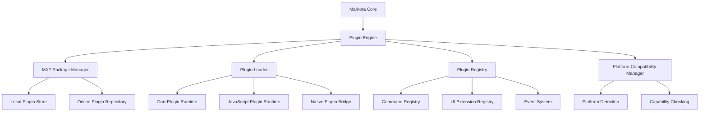

# Markora 插件系统 V3.0 设计方案

## 概述

基于 VS Code 扩展模型，设计一套完全解耦、动态加载的插件体系，主程序仅保留 Markdown 编辑器核心功能，所有其他功能通过 MXT 插件包实现。

## 设计目标

### 1. 完全解耦
- 主程序与插件零依赖
- 插件可独立开发、测试、发布
- 支持热插拔，无需重启应用

### 2. 平台兼容性
- 插件明确声明支持的平台
- 不兼容插件自动隐藏或禁用
- 平台特定功能的优雅降级

### 3. 动态扩展
- JavaScript/Dart 混合插件架构
- 运行时注册 UI 组件和功能
- 支持复杂的插件间通信

## 核心架构

### 1. 插件引擎架构



### 2. 主程序核心功能

主程序保留的最小功能集：

```yaml
Core Features:
  - Markdown 编辑器 (基础语法高亮)
  - 基础文件管理 (新建、打开、保存)
  - 插件管理器 (安装、卸载、配置)
  - 基础设置系统
  - 主题框架 (不包含具体主题)

Removed from Core:
  - 数学公式渲染 → Math Plugin
  - Mermaid 图表 → Mermaid Plugin  
  - 代码高亮 → Syntax Highlighting Plugin
  - 导出功能 → Export Plugins (PDF, HTML, etc.)
  - 预览模式 → Preview Plugin
  - 搜索功能 → Search Plugin
```

### 3. MXT 插件包格式 V3.0

#### 3.1 插件包结构

```
plugin_name_v1.0.0.mxt (ZIP format)
├── manifest.json          # 插件清单
├── main.dart              # Dart 入口点 (可选)
├── main.js                # JavaScript 入口点 (可选)
├── assets/                # 静态资源
│   ├── icons/
│   ├── themes/
│   └── templates/
├── locales/               # 国际化文件
│   ├── en.json
│   └── zh.json
├── platforms/             # 平台特定代码
│   ├── windows/
│   ├── macos/
│   ├── linux/
│   ├── android/
│   └── ios/
└── webview/               # WebView 资源 (可选)
    ├── index.html
    ├── styles.css
    └── scripts.js
```

#### 3.2 插件清单格式

```json
{
  "apiVersion": "3.0.0",
  "kind": "Plugin",
  "metadata": {
    "id": "com.markora.plugin.mermaid",
    "name": "Mermaid Diagrams",
    "version": "1.0.0",
    "description": "Render beautiful Mermaid diagrams",
    "author": "Markora Team",
    "license": "MIT",
    "homepage": "https://markora.dev/plugins/mermaid",
    "repository": "https://github.com/markora/mermaid-plugin",
    "keywords": ["diagram", "chart", "visualization"]
  },
  "spec": {
    "category": "renderer",
    "type": "hybrid",
    "platforms": {
      "windows": { "supported": true, "minVersion": "10" },
      "macos": { "supported": true, "minVersion": "10.15" },
      "linux": { "supported": true },
      "android": { "supported": false, "reason": "WebView limitations" },
      "ios": { "supported": false, "reason": "WebView limitations" },
      "web": { "supported": true }
    },
    "entryPoints": {
      "dart": "main.dart",
      "javascript": "main.js"
    },
    "permissions": [
      "editor.read",
      "editor.write", 
      "ui.toolbar",
      "ui.menu",
      "webview.create",
      "file.read"
    ],
    "dependencies": {
      "core": ">=2.0.0",
      "plugins": {
        "markdown-renderer": ">=1.0.0"
      }
    },
    "activationEvents": [
      "onLanguage:mermaid",
      "onCommand:mermaid.insert",
      "onFileExtension:.mmd"
    ],
    "contributes": {
      "commands": [
        {
          "id": "mermaid.insert",
          "title": "Insert Mermaid Diagram",
          "category": "Mermaid"
        }
      ],
      "toolbar": [
        {
          "id": "mermaid.toolbar",
          "group": "editor",
          "priority": 100,
          "items": [
            {
              "command": "mermaid.insert",
              "icon": "project-diagram",
              "tooltip": "Insert Mermaid Diagram"
            }
          ]
        }
      ],
      "menus": {
        "editor/context": [
          {
            "command": "mermaid.insert",
            "when": "selection.empty",
            "group": "insert"
          }
        ]
      },
      "languages": [
        {
          "id": "mermaid",
          "aliases": ["Mermaid", "mermaid"],
          "extensions": [".mmd"],
          "configuration": "language-configuration.json"
        }
      ],
      "renderers": [
        {
          "language": "mermaid",
          "type": "webview",
          "handler": "mermaid.render"
        }
      ]
    },
    "configuration": {
      "title": "Mermaid Settings",
      "properties": {
        "mermaid.theme": {
          "type": "string",
          "default": "default",
          "enum": ["default", "dark", "forest", "neutral"],
          "description": "Mermaid diagram theme"
        },
        "mermaid.enableInteraction": {
          "type": "boolean",
          "default": true,
          "description": "Enable diagram interaction"
        }
      }
    }
  }
}
```

### 4. 插件运行时架构

#### 4.1 JavaScript 插件引擎

```javascript
// 插件 JavaScript API
class MarkoraPluginAPI {
  constructor(pluginId) {
    this.pluginId = pluginId;
  }

  // 编辑器 API
  get editor() {
    return {
      getContent: () => window.markora.editor.getContent(),
      setContent: (content) => window.markora.editor.setContent(content),
      insertText: (text) => window.markora.editor.insertText(text),
      getSelection: () => window.markora.editor.getSelection(),
      replaceSelection: (text) => window.markora.editor.replaceSelection(text)
    };
  }

  // UI 扩展 API
  get ui() {
    return {
      registerCommand: (id, handler) => 
        window.markora.commands.register(this.pluginId, id, handler),
      
      addToolbarItem: (item) => 
        window.markora.toolbar.addItem(this.pluginId, item),
      
      showNotification: (message, type) => 
        window.markora.notifications.show(message, type),
      
      createWebView: (options) => 
        window.markora.webview.create(this.pluginId, options)
    };
  }

  // 存储 API
  get storage() {
    return {
      get: (key) => window.markora.storage.get(this.pluginId, key),
      set: (key, value) => window.markora.storage.set(this.pluginId, key, value),
      remove: (key) => window.markora.storage.remove(this.pluginId, key)
    };
  }

  // 事件 API
  get events() {
    return {
      on: (event, handler) => 
        window.markora.events.on(this.pluginId, event, handler),
      
      emit: (event, data) => 
        window.markora.events.emit(this.pluginId, event, data),
      
      off: (event, handler) => 
        window.markora.events.off(this.pluginId, event, handler)
    };
  }
}

// 插件激活函数
function activate(context) {
  const api = new MarkoraPluginAPI(context.pluginId);
  
  // 注册命令
  api.ui.registerCommand('mermaid.insert', () => {
    const template = '```mermaid\ngraph TD\n    A[Start] --> B[End]\n```';
    api.editor.insertText(template);
  });
  
  // 注册渲染器
  api.renderers.register('mermaid', (content) => {
    return api.ui.createWebView({
      html: generateMermaidHTML(content),
      width: '100%',
      height: '400px'
    });
  });
}

// 插件停用函数
function deactivate() {
  // 清理资源
}
```

#### 4.2 Dart 插件接口

```dart
// lib/core/plugin_api/plugin_api.dart
abstract class PluginAPI {
  // 编辑器 API
  EditorAPI get editor;
  
  // UI 扩展 API
  UIAPI get ui;
  
  // 存储 API
  StorageAPI get storage;
  
  // 事件 API
  EventAPI get events;
  
  // 渲染器 API
  RendererAPI get renderers;
  
  // 文件系统 API
  FileSystemAPI get fileSystem;
}

// 插件基类
abstract class MarkoraPlugin {
  late PluginAPI api;
  late PluginMetadata metadata;
  
  Future<void> activate(PluginContext context);
  Future<void> deactivate();
  
  Future<void> onConfigChanged(Map<String, dynamic> config);
  Widget? getConfigWidget();
}

// 具体插件实现示例
class MermaidPlugin extends MarkoraPlugin {
  @override
  Future<void> activate(PluginContext context) async {
    api = context.api;
    metadata = context.metadata;
    
    // 注册命令
    api.ui.registerCommand('mermaid.insert', _insertMermaidBlock);
    
    // 注册渲染器
    api.renderers.register('mermaid', _renderMermaidDiagram);
    
    // 注册工具栏按钮
    api.ui.addToolbarItem(ToolbarItem(
      id: 'mermaid.insert',
      icon: PhosphorIcons.flowArrow,
      tooltip: 'Insert Mermaid Diagram',
      command: 'mermaid.insert',
    ));
  }
  
  void _insertMermaidBlock() {
    const template = '```mermaid\ngraph TD\n    A[Start] --> B[End]\n```';
    api.editor.insertText(template);
  }
  
  Widget _renderMermaidDiagram(String content) {
    return MermaidWebView(content: content);
  }
}
```

### 5. 平台兼容性管理

#### 5.1 平台检测和兼容性矩阵

```dart
// lib/core/platform/platform_manager.dart
class PlatformManager {
  static final PlatformManager _instance = PlatformManager._internal();
  factory PlatformManager() => _instance;
  PlatformManager._internal();

  PlatformInfo get currentPlatform => PlatformInfo(
    type: _getPlatformType(),
    version: _getPlatformVersion(),
    capabilities: _getPlatformCapabilities(),
  );

  bool isPluginCompatible(PluginMetadata plugin) {
    final platformSupport = plugin.platforms[currentPlatform.type];
    if (platformSupport == null || !platformSupport.supported) {
      return false;
    }
    
    // 检查版本兼容性
    if (platformSupport.minVersion != null) {
      return currentPlatform.version >= platformSupport.minVersion!;
    }
    
    // 检查功能依赖
    for (final capability in plugin.requiredCapabilities) {
      if (!currentPlatform.capabilities.contains(capability)) {
        return false;
      }
    }
    
    return true;
  }

  List<String> getIncompatibilityReasons(PluginMetadata plugin) {
    final reasons = <String>[];
    final platformSupport = plugin.platforms[currentPlatform.type];
    
    if (platformSupport == null) {
      reasons.add('Platform ${currentPlatform.type} is not supported');
    } else if (!platformSupport.supported) {
      reasons.add(platformSupport.reason ?? 'Platform not supported');
    }
    
    return reasons;
  }
}
```

#### 5.2 插件列表 UI 设计

```dart
// 插件管理页面
class PluginManagementPage extends StatelessWidget {
  @override
  Widget build(BuildContext context) {
    return Consumer(
      builder: (context, ref, child) {
        final plugins = ref.watch(availablePluginsProvider);
        final platformManager = PlatformManager();
        
        // 按兼容性分组
        final compatiblePlugins = plugins
            .where((p) => platformManager.isPluginCompatible(p.metadata))
            .toList();
        final incompatiblePlugins = plugins
            .where((p) => !platformManager.isPluginCompatible(p.metadata))
            .toList();
        
        return Column(
          children: [
            // 兼容插件列表
            if (compatiblePlugins.isNotEmpty) ...[
              const SectionHeader(title: 'Available Plugins'),
              ...compatiblePlugins.map((plugin) => PluginCard(
                plugin: plugin,
                isCompatible: true,
              )),
            ],
            
            // 不兼容插件列表
            if (incompatiblePlugins.isNotEmpty) ...[
              const SectionHeader(title: 'Incompatible Plugins'),
              ...incompatiblePlugins.map((plugin) => PluginCard(
                plugin: plugin,
                isCompatible: false,
                incompatibilityReasons: platformManager
                    .getIncompatibilityReasons(plugin.metadata),
              )),
            ],
          ],
        );
      },
    );
  }
}

class PluginCard extends StatelessWidget {
  const PluginCard({
    super.key,
    required this.plugin,
    required this.isCompatible,
    this.incompatibilityReasons = const [],
  });

  final PluginPackage plugin;
  final bool isCompatible;
  final List<String> incompatibilityReasons;

  @override
  Widget build(BuildContext context) {
    return Card(
      opacity: isCompatible ? 1.0 : 0.6,
      child: Column(
        children: [
          ListTile(
            leading: CircleAvatar(
              child: Icon(plugin.metadata.icon),
            ),
            title: Text(plugin.metadata.name),
            subtitle: Column(
              crossAxisAlignment: CrossAxisAlignment.start,
              children: [
                Text(plugin.metadata.description),
                const SizedBox(height: 4),
                PlatformCompatibilityBadges(
                  platforms: plugin.metadata.platforms,
                ),
              ],
            ),
            trailing: isCompatible
                ? ElevatedButton(
                    onPressed: () => _installPlugin(plugin),
                    child: const Text('Install'),
                  )
                : Tooltip(
                    message: incompatibilityReasons.join('\n'),
                    child: const Icon(
                      Icons.block,
                      color: Colors.red,
                    ),
                  ),
          ),
          if (!isCompatible)
            Padding(
              padding: const EdgeInsets.all(16),
              child: WarningCard(
                title: 'Platform Incompatible',
                reasons: incompatibilityReasons,
              ),
            ),
        ],
      ),
    );
  }
}
```

### 6. 插件管理系统

#### 6.1 MXT 包管理器

```dart
// lib/core/plugin_manager/mxt_package_manager.dart
class MxtPackageManager {
  static const String _pluginsDir = 'plugins';
  static const String _cacheDir = 'plugin_cache';

  Future<PluginPackage> installFromFile(String mxtFilePath) async {
    try {
      // 验证 MXT 包
      final package = await _validateMxtPackage(mxtFilePath);
      
      // 检查平台兼容性
      if (!PlatformManager().isPluginCompatible(package.metadata)) {
        throw PluginIncompatibleException(
          PlatformManager().getIncompatibilityReasons(package.metadata),
        );
      }
      
      // 检查依赖
      await _checkDependencies(package.metadata);
      
      // 解压安装
      final pluginDir = await _extractPlugin(mxtFilePath, package.metadata.id);
      
      // 注册插件
      await _registerPlugin(package);
      
      // 触发安装事件
      PluginEventBus().emit(PluginEvent.installed(package.metadata.id));
      
      return package;
    } catch (e) {
      throw PluginInstallationException('Failed to install plugin: $e');
    }
  }

  Future<void> uninstallPlugin(String pluginId) async {
    try {
      // 停用插件
      await PluginLoader().deactivatePlugin(pluginId);
      
      // 清理文件
      await _cleanupPlugin(pluginId);
      
      // 注销插件
      await _unregisterPlugin(pluginId);
      
      // 触发卸载事件
      PluginEventBus().emit(PluginEvent.uninstalled(pluginId));
    } catch (e) {
      throw PluginUninstallationException('Failed to uninstall plugin: $e');
    }
  }

  Future<List<PluginPackage>> getAvailablePlugins() async {
    // 从在线仓库获取插件列表
    return await _fetchOnlinePlugins();
  }

  Future<void> updatePlugin(String pluginId) async {
    final currentPlugin = await _getInstalledPlugin(pluginId);
    final latestVersion = await _getLatestVersion(pluginId);
    
    if (latestVersion.version > currentPlugin.metadata.version) {
      await _performUpdate(pluginId, latestVersion);
    }
  }
}
```

#### 6.2 插件加载器

```dart
// lib/core/plugin_loader/plugin_loader.dart
class PluginLoader {
  final Map<String, LoadedPlugin> _loadedPlugins = {};
  final PluginAPI _pluginAPI = PluginAPIImpl();

  Future<void> loadPlugin(String pluginId) async {
    try {
      final package = await _getPluginPackage(pluginId);
      
      // 检查激活条件
      if (!_shouldActivatePlugin(package)) {
        return;
      }
      
      LoadedPlugin? loadedPlugin;
      
      // 根据插件类型选择加载方式
      if (package.metadata.entryPoints.containsKey('dart')) {
        loadedPlugin = await _loadDartPlugin(package);
      } else if (package.metadata.entryPoints.containsKey('javascript')) {
        loadedPlugin = await _loadJavaScriptPlugin(package);
      }
      
      if (loadedPlugin != null) {
        _loadedPlugins[pluginId] = loadedPlugin;
        
        // 激活插件
        await _activatePlugin(loadedPlugin);
        
        PluginEventBus().emit(PluginEvent.loaded(pluginId));
      }
    } catch (e) {
      PluginEventBus().emit(PluginEvent.error(pluginId, e.toString()));
    }
  }

  Future<LoadedPlugin> _loadDartPlugin(PluginPackage package) async {
    // 动态加载 Dart 插件
    final pluginPath = _getPluginPath(package.metadata.id);
    final entryPoint = package.metadata.entryPoints['dart']!;
    
    // 使用 Isolate 或反射加载插件
    final plugin = await _instantiateDartPlugin(pluginPath, entryPoint);
    
    return LoadedPlugin(
      metadata: package.metadata,
      instance: plugin,
      type: PluginType.dart,
    );
  }

  Future<LoadedPlugin> _loadJavaScriptPlugin(PluginPackage package) async {
    // 加载 JavaScript 插件
    final pluginPath = _getPluginPath(package.metadata.id);
    final entryPoint = package.metadata.entryPoints['javascript']!;
    
    final jsEngine = JavaScriptEngine();
    await jsEngine.loadScript(path.join(pluginPath, entryPoint));
    
    return LoadedPlugin(
      metadata: package.metadata,
      instance: jsEngine,
      type: PluginType.javascript,
    );
  }

  Future<void> _activatePlugin(LoadedPlugin plugin) async {
    final context = PluginContext(
      pluginId: plugin.metadata.id,
      api: _pluginAPI,
      metadata: plugin.metadata,
    );

    if (plugin.type == PluginType.dart) {
      await (plugin.instance as MarkoraPlugin).activate(context);
    } else if (plugin.type == PluginType.javascript) {
      await (plugin.instance as JavaScriptEngine).callFunction('activate', [context]);
    }
  }
}
```

### 7. 插件开发工具链

#### 7.1 插件项目模板

```bash
# 插件开发 CLI 工具
markora plugin create --name my-plugin --type hybrid
markora plugin build
markora plugin test
markora plugin package
markora plugin publish
```

#### 7.2 开发环境配置

```yaml
# plugin_dev.yaml
plugin:
  id: com.example.my-plugin
  name: My Plugin
  version: 1.0.0
  type: hybrid

development:
  hot_reload: true
  debug_mode: true
  watch_files: true
  test_environment: true

build:
  minify_js: true
  optimize_assets: true
  include_source_maps: false

packaging:
  output_dir: dist
  include_dev_dependencies: false
  sign_package: true
```

### 8. 核心插件重构计划

#### 8.1 Mermaid 插件增强

```javascript
// plugins/mermaid_plugin/main.js
class MermaidPlugin {
  activate(context) {
    this.api = new MarkoraPluginAPI(context.pluginId);
    
    // 注册命令
    this.api.ui.registerCommand('mermaid.insert', this.insertDiagram.bind(this));
    this.api.ui.registerCommand('mermaid.preview', this.previewDiagram.bind(this));
    
    // 注册渲染器
    this.api.renderers.register('mermaid', this.renderDiagram.bind(this));
    
    // 注册工具栏
    this.api.ui.addToolbarItem({
      id: 'mermaid.insert',
      icon: 'project-diagram',
      tooltip: 'Insert Mermaid Diagram',
      command: 'mermaid.insert'
    });
  }

  insertDiagram() {
    const templates = {
      flowchart: 'graph TD\n    A[Start] --> B[End]',
      sequence: 'sequenceDiagram\n    Alice->>Bob: Hello',
      gantt: 'gantt\n    title Project Timeline\n    section Phase 1\n    Task 1: 2024-01-01, 7d'
    };
    
    // 显示模板选择对话框
    this.api.ui.showQuickPick({
      items: Object.keys(templates),
      placeholder: 'Select diagram type'
    }).then(selected => {
      if (selected) {
        const template = `\`\`\`mermaid\n${templates[selected]}\n\`\`\``;
        this.api.editor.insertText(template);
      }
    });
  }

  renderDiagram(content) {
    return this.api.ui.createWebView({
      html: this.generateMermaidHTML(content),
      scripts: ['https://cdn.jsdelivr.net/npm/mermaid/dist/mermaid.min.js'],
      onMessage: this.handleWebViewMessage.bind(this)
    });
  }

  generateMermaidHTML(content) {
    return `
      <!DOCTYPE html>
      <html>
      <head>
        <script src="https://cdn.jsdelivr.net/npm/mermaid/dist/mermaid.min.js"></script>
      </head>
      <body>
        <div class="mermaid">${content}</div>
        <script>
          mermaid.initialize({ startOnLoad: true });
        </script>
      </body>
      </html>
    `;
  }
}

// 插件入口
function activate(context) {
  const plugin = new MermaidPlugin();
  plugin.activate(context);
  return plugin;
}
```

#### 8.2 Pandoc 插件实现

```dart
// plugins/pandoc_plugin/lib/main.dart
class PandocPlugin extends MarkoraPlugin {
  late PandocService _pandocService;

  @override
  Future<void> activate(PluginContext context) async {
    super.activate(context);
    
    _pandocService = PandocService();
    await _pandocService.initialize();
    
    // 注册导出命令
    api.ui.registerCommand('pandoc.export', _showExportDialog);
    api.ui.registerCommand('pandoc.import', _showImportDialog);
    
    // 注册菜单项
    api.ui.addMenuItem({
      id: 'file/export',
      items: [
        MenuItem(
          id: 'pandoc.export',
          title: 'Export with Pandoc...',
          command: 'pandoc.export',
        ),
      ],
    });
  }

  Future<void> _showExportDialog() async {
    final formats = [
      'PDF', 'HTML', 'DOCX', 'ODT', 'LaTeX', 'RTF', 'EPUB'
    ];
    
    final selectedFormat = await api.ui.showSelectDialog(
      title: 'Export Format',
      options: formats,
    );
    
    if (selectedFormat != null) {
      await _exportDocument(selectedFormat.toLowerCase());
    }
  }

  Future<void> _exportDocument(String format) async {
    final content = api.editor.getContent();
    final outputPath = await api.ui.showSaveDialog(
      defaultExtension: format,
      filters: _getFileFilters(format),
    );
    
    if (outputPath != null) {
      api.ui.showProgress(
        title: 'Exporting...',
        task: () => _pandocService.convert(
          content: content,
          from: 'markdown',
          to: format,
          outputPath: outputPath,
        ),
      );
    }
  }

  Future<void> _showImportDialog() async {
    final filePath = await api.ui.showOpenDialog(
      filters: _getSupportedImportFormats(),
    );
    
    if (filePath != null) {
      final content = await _pandocService.convert(
        inputPath: filePath,
        to: 'markdown',
      );
      
      api.editor.setContent(content);
    }
  }
}

class PandocService {
  String? _pandocPath;

  Future<void> initialize() async {
    // 查找 Pandoc 可执行文件
    _pandocPath = await _findPandocExecutable();
    if (_pandocPath == null) {
      throw PandocNotFoundException();
    }
  }

  Future<String> convert({
    String? content,
    String? inputPath,
    required String to,
    String from = 'markdown',
    String? outputPath,
  }) async {
    final args = <String>[
      if (inputPath != null) inputPath else '-',
      '--from', from,
      '--to', to,
      if (outputPath != null) ...['-o', outputPath],
    ];

    final process = await Process.start(_pandocPath!, args);
    
    if (content != null) {
      process.stdin.write(content);
      await process.stdin.close();
    }

    final result = await process.exitCode;
    if (result != 0) {
      final error = await process.stderr.transform(utf8.decoder).join();
      throw PandocConversionException(error);
    }

    if (outputPath == null) {
      return await process.stdout.transform(utf8.decoder).join();
    }
    
    return outputPath;
  }
}
```

## 实施计划

### 阶段 1: 核心重构 (2-3 周)
1. 重构主程序，移除非核心功能
2. 实现新的插件引擎
3. 创建 MXT V3.0 包格式
4. 实现平台兼容性管理

### 阶段 2: 插件迁移 (2 周)
1. 将 Mermaid 插件重构为独立 MXT 包
2. 实现 Pandoc 插件完整功能
3. 创建插件开发工具链
4. 完善插件管理界面

### 阶段 3: 生态建设 (持续)
1. 建立插件仓库
2. 创建插件开发文档
3. 开发更多核心插件
4. 社区插件支持

## 技术优势

1. **完全解耦**: 主程序与插件零依赖，独立开发和部署
2. **平台感知**: 智能的平台兼容性检查和用户提示
3. **动态扩展**: 运行时加载和卸载插件，支持热更新
4. **多语言支持**: JavaScript 和 Dart 混合插件架构
5. **标准化**: 基于 VS Code 的成熟扩展模型
6. **开发友好**: 完整的开发工具链和调试支持

这个设计将使 Markora 成为一个真正可扩展的编辑器平台，为用户和开发者提供无限的可能性。