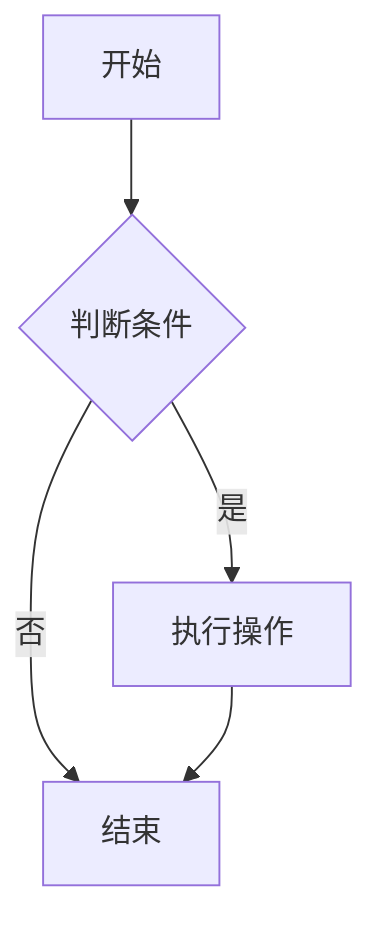
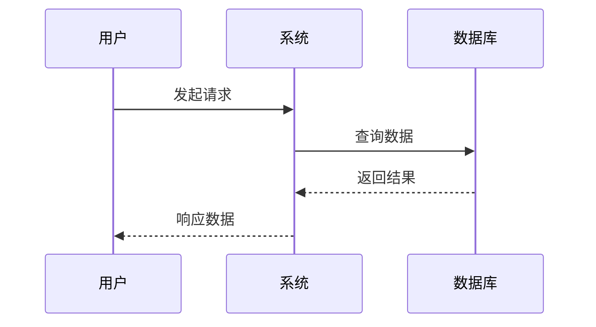
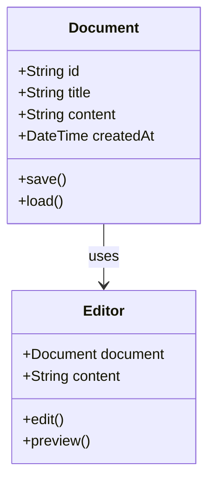
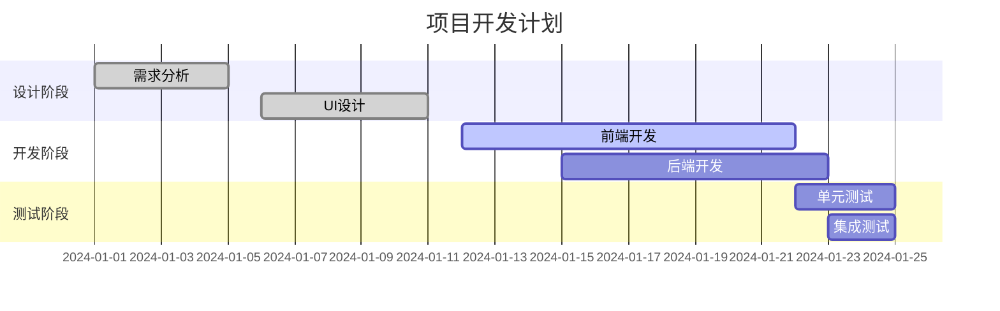

# Mermaid 图表测试

## 流程图



## 时序图



## 类图



## 甘特图



## Git 图

```mermaid
gitgraph
    commit
    commit
    branch develop
    checkout develop
    commit
    commit
    checkout main
    merge develop
    commit
``` 